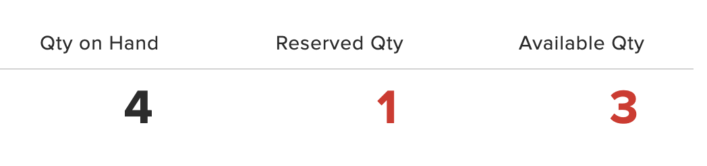
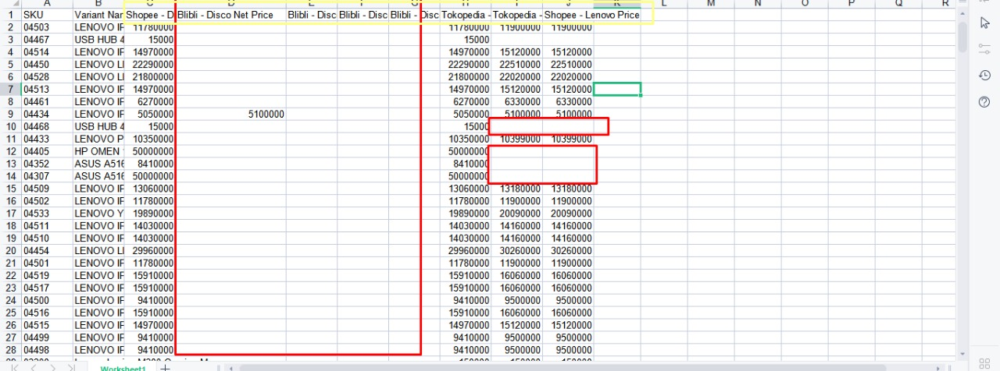
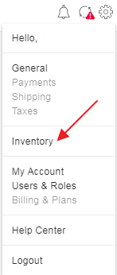
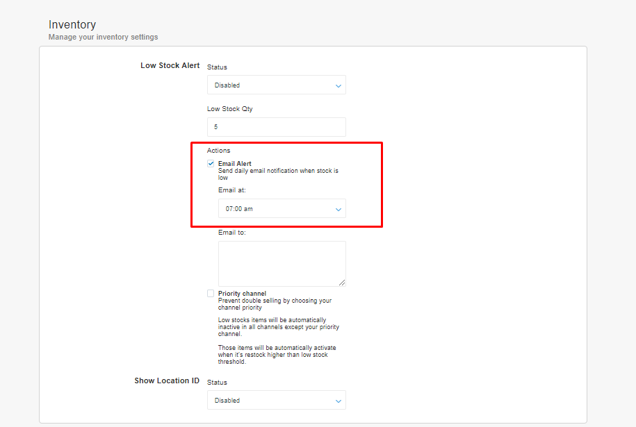
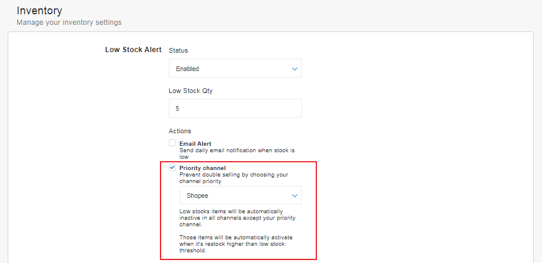

# FAQ - Inventory

### Apa bedanya Qty on hand, Qty Reserved, Qty Available?

**Cara perhitungan quantity** &#x20;

Qty on Hand - Reserved Qty = Available Qty

* **Qty on Hand**: Jumlah item fisik di gudang yang siap dijual. (Tidak termasuk stok yang rusak)
* **Qty Reserved:** Jumlah item ditahan yang belum diproses untuk suatu order. Status Pending payment (belum dibayar) atau open (perlu di proses).
* **Qty Available:** Jumlah sisa item yang bisa dibeli di Marketplace/ webstore. (Dihitung oleh sistem secara otomatis)&#x20;


Jika system anda hanya mempunyai satu tipe stok seperti di Shopify, Tokopedia, Shopee, POS system, Qty tersebut adalah **Qty available**.&#x20;

**Scenario:** Qty fisik digudang = **10**. Terjadi order **Qty 2 tetapi belum di proses**, secara system qty langsung berkurang **Qty 8.** Apabila anda melakukan stock opnam digudang, secara Qty fisik digudang masih = **10.** Jika anda update stock menjadi  **Qty** **10** dan order yang belum di proces tadi dibatalkan oleh customer karena tidak jadi bayar atau berubah pikiran, maka **Order Qty 2** akan di balikan ke system secara otomatis. Qty baru anda yang dapat dibeli menjadi **12** sedangkan qty fisik digudang hanya ada **10.** Ini dapat menyebabkan overselling.&#x20;

Tapi **** jika anda mengunakan inventory system seperti Forstok, anda hanya perlu **update ke Qty on Hand sesuai jumlah item fisik digudang. Jadi Qty on Hand = 10, Qty reserved 2, Qty available 8. Jika order dibatalkan, Qty on hand 10, Qt reserved 0, Qty available 10.** Scenario diatas tidak akan terjadi.&#x20;


### Template Update stock di Forstok. Final Qty or Delta Qty

#### Template update stock using Final Qty

.png>)

#### Template update stock using Qty Changed (+/-)


Sample Template update stock Forstok


### **Apakah bisa **_**set up**_** harga coret dari Forstok?**

Saat ini untuk _marketplace_ Shopee, Tokopedia dan JD.ID harga coretnya sementara hanya bisa dilakukan setupnya melalui _marketplace_ sedangkan untuk _marketplace_ lain sudah bisa melakukan harga coret langsung di dasbor Forstok melalui fitur p_romotion_.

### Apa yang harus dilakukan jika ada perubahan nama produk/SKU dll?

Apabila ada perubahan nama/SKU/detail variant/struktur variant(penambahan/pengurangan variant) ketika sudah terhubung dengan Forstok, perlu dilakukan _remove listing_ kemudian melakukan import ulang kembali agar nama/sku/detail variant/struktur variant tersebut terupdate di Forstok.

### **Bagaimana jika sudah upload produk namun gagal?**

Apabila gagal melakukan upload produk/listing pada umumnya dikarenakan untuk exportnya masih Off. Ketika ingin melakukan listing pastikan hal-hal berikut:

Stok tersedia (untuk yang baru pertama menggunakan Forstok mulai menggunakan Forstok harap melalakunan update stok **perdana** melalui Forstok) dan memastikan bahwa export item sudah aktif.

Note: Jika saat listing produk dalam kondisi export Off, maka akan ada pemberitahuan gagal export listing ke _marketplace_. Solusi: export di On kan - lalu klik edit utk SKU yang gagal listing sebelumnya - kemudian tambahkan beberapa deskripsi misal titik atau koma pada salah satu _field_ setelah itu _save_ (hal ini bertujuan untuk mendatangkan kembali listingan yang sebelumnya gagal dan bisa ke export).

### Apakah nama produk dan harga akan berpengaruh ke stok?

Perbedaan harga dan perbedaan nama produk tidak akan berpengaruh dengan stok karena untuk saat ini Forstok melakukan pemetaan (mapping) berdasarkan kode SKU pada setiap item/produk.

### **Apakah ada limitasi untuk edit produk di dashboard Forstok?**

Limitasi deskripsi karakter kalau untuk marketplace Shopee  5000 karakter. Sedangkan kalau untuk Tokopedia, dibagian nama produk / nama items tidak boleh lebih dari 70 karakter.

Apabila muncul tampilan seperti ini untuk image tokopedianya silahkan upload ulang jika menemukan message seperti ini dengan ketentuan sebagai berikut:

1. Edit item.
2. Hapus image yang lama item tokopedia tersebut pada menu edit item.
3. Upload kembali resolusi yang disarankan 800x800 pixel, sedangkan untuk ukurannya maksimal 2MB.
4. Merubah deskripsi items.
5. Simpan _(sav_e) dan kami sarankan untuk merubah image tokopedia dengan cara upload baru saat add listing jika masternya dari Shopee.

### **Bagaimana caranya untuk mengecek SKU mana yang belum masuk ke Forstok?**

Sebenarnya saat ini Forstok belum memiliki fitur ataupun filter untuk mengetahui list SKU yang belum masuk ke Forstok. Namun dapat kita ketahui dengan menggunakan 2 opsi berikut ini:

1. _Cross Listing_

Melalui fitur _cross listing_ dapat memilih channel tujuan yang ingin kita lihat list SKU apa saja yg belum ada di channel tujuan tersebut. Selanjutnya akan tampil nominal angkanya. Kemudian untuk melihat dari angka tersebut, harus melakukan _mapping destination_ _category_ terlebih dahulu, lalu submit. Setelah itu kita bisa melihat di list excel SKU tersebut yang belum terlisting di channel tersebut.

_2. Upload price adjustment_

Pada tampilan berikut ini akan terihat bahwa ada filter by harga. Jika kolomnya ada harga, berarti di marketplace tersebut ada SKUnya. Jika terdapat kolom kosong, berarti di marketplace tsb itemnya/SKUnya tidak ada.

### **Apakah untuk pengaturan **_**price adjustment**_** dapat menggunakan waktu? Misalnya ketika ingin **_**update**_** harga di awal tahun 2023 Januari, apakah bisa diatur dibulan Desember 2022?**

Jika ingin melakukan pengaturan _price adjustment_ dengan menggunakan waktu bisa melalui menu _upload price adjustment_ via excel dan _menu adjust price_ via dashboard forstok. Berikut tampilannya.

### Apakah ada perbedaan jika ingin merubah harga melalui dashboard dengan melalui template excel?

Jika ingin melakukan perubahan harga dengan menggunakan _User Interface_ (dashboard) maka bisa dipilih menu _adjust price_ dan akan diarahkan untuk mengisi beberapa kolom yang bersifat _mandatory_ (wajib) diisi.

Sedangkan jika ingin melakukan perubahan harga dengan menggunakan template excel bisa langsung mengisi harga final (akhir) di kolom excel yang telah disediakan.

### Bagaimana caranya update price tiktok?

Untuk update price tiktok untuk saat ini memang belum dapat dilakukan dan sudah kami sampaikan di broadcast tiktok berikut informasi lengkap nya : [https://docs.forstok.com/knowledge-base/integrations/tiktok](https://docs.forstok.com/knowledge-base/integrations/tiktok)

Untuk update price tiktok saat ini hanya bisa dilakukan di seller center langsung. Tiktok saat ini hanya mendukung: import item, update stok, import order.

### Bagaimana jika pada status produk terdapat tanda seru dan keterangannya _waiting for quality approval_?

Untuk status _waiting for quality approval_, approvalnya dari pihak marketplace. Status ini artinya sudah masuk ke dalam antrian marketplace untuk di QC _(Quality Control)_ oleh tim _marketplace_, mohon ditunggu saja sampai status approved maka di forstok statusnya akan _green check_.

### Bagaimana Set Priority Channel?

_Priority channel_ merupakan barang dengan stok rendah akan secara otomatis tidak aktif di semua saluran kecuali saluran prioritas Anda. Barang-barang itu akan secara otomatis diaktifkan ketika mengisi kembali lebih tinggi dari ambang batas stok rendah.

Berikut langkah-langkah yang dilakukan untuk set priority channel :&#x20;

1\. Klik setting pada pojok kanan atas.&#x20;

2\. Klik Inventory.

3\. Pada halaman inventory, klik email alert. untuk mengaktifkan notifikasi otomatis ke email apabila stok sudah mencapai batas yang ditentukan.

4\. Lalu bisa dipilih waktu pengiriman email notifikasi, secara otomatis email akan dikirim sesuai dengan waktu yang ditentukan.

5\. Kemudian, cheklist priority channel dan pilih sales channel apa yang akan di buat sebagai priority channel. Kemudian status ubah menjadi enable dan low stock di set sesuai dengan kebutuhan.

6\. Klik SAVE.

**Notes** :&#x20;

* Untuk menentukan minimal stok yang akan dibuat priority channel bisa di set di _low stock Qty._
