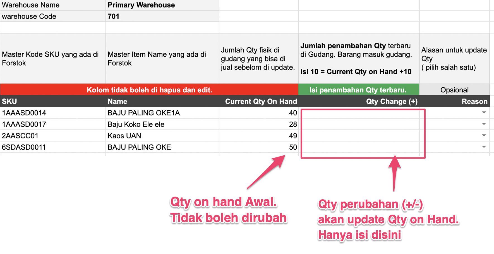

# FAQ - Inventory

## Apa bedanya Qty on hand, Qty Reserved, Qty Available?

### **Cara perhitungan quantity**  

Qty on Hand - Reserved Qty = Available Qty

* **Qty on Hand**: Jumlah item fisik di gudang
* **Qty Reserved:** Jumlah item ditahan yang belum diproses untuk suatu order. Status Pending payment \(belum dibayar\) atau open \(perlu di proses\).
* **Qty Available:** Jumlah sisa item yang bisa dibeli.


Jika system anda hanya mempunyai satu tipe stok seperti di Shopify, Tokopedia, Shopee, POS system, Qty tersebut adalah **Qty available**. 

**Scenario:** Qty fisik digudang = **10**. Terjadi order **Qty 2 tetapi belum di proses**, secara system qty langsung berkurang **Qty 8.** Apabila anda melakukan stock opnam digudang, secara Qty fisik digudang masih = **10.** Jika anda update stock menjadi  **Qty** **10** dan order yang belum di proces tadi dibatalkan oleh customer karena tidak jadi bayar atau berubah pikiran, maka **Order Qty 2** akan di balikan ke system secara otomatis. Qty baru anda menjadi **12** sedangkan qty fisik digudang = **10.**

Tapi ****jika anda mengunakan inventory system seperti Forstok, anda hanya perlu **update ke Qty on Hand sesuai jumlah item fisik digudang. Jadi Qty on Hand = 10, Qty reserved 2, Qty available 8. Jika order dibatalkan, Qty on hand 10, Qt reserved 0, Qty available 10.** Scenario diatas tidak akan terjadi. 


## Template Update stock di Forstok. Final Qty or Delta Qty

#### Template update stock using Final Qty

#### Template update stock using Qty Changed \(+/-\)

