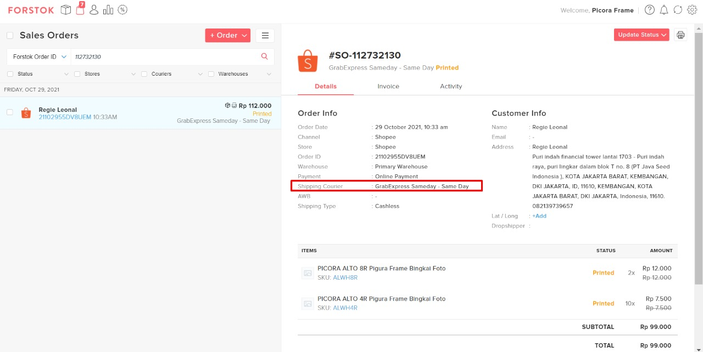
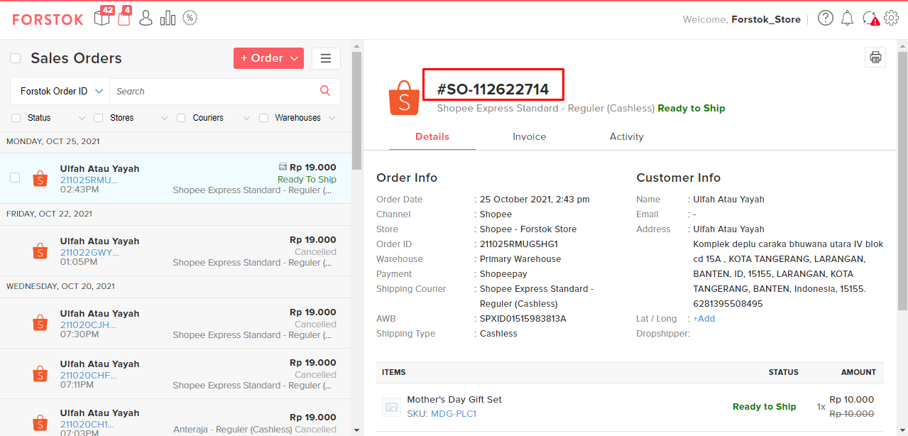

# FAQ - Orders

### **Bagaimana di Forstok** bisa terjadi Oversell?

Beberapa faktor yang menyebabkan oversell:

1. Stock limitation.\
   Kita sarankan menggunakan fitur priority channel. Fitur ini bertujuan agar SKU tersebut hanya di jual di satu _channel (marketplace)_ saja.\
   [https://docs.forstok.com/knowledge-base/inventory/priority-channel-store](https://docs.forstok.com/knowledge-base/inventory/priority-channel-store)
2. Delay order yang masuk.
3. Expired API token.

### **Kapan proses order (pesanan) memotong stok yang ada di Forstok?**

Proses order (pesanan) akan memotong stok apabila statusnya sudah menjadi _pending payment_ (pembayaran yang tertunda) dan akan masuk ke dalam  _reserved quantity_. Ada beberapa _marketplace_ yang menerapkan sistem _pending payment_ diantaranya adalah, Shopee, Lazada dan Blibli. Namun, untuk _marketplace_ yang tidak menerapkan sistem _pending payment_, maka akan otomatis memotong stok tersebut dari _quantity on hand_. Berikut kami lampirkan dokumentasi _mapping_ order di Forstok. [https://docs.google.com/spreadsheets/d/1N38sX9c57xPJ5o\_2T8Qv8cr41tuHhO\_L1I2T0QHjCiI/edit#gid=0](https://docs.google.com/spreadsheets/d/1N38sX9c57xPJ5o\_2T8Qv8cr41tuHhO\_L1I2T0QHjCiI/edit#gid=0)

### **Apakah jika saya memiliki penjualan lain dari luar **_**ecommerce**_** yang terintegrasi di Forstok, bagaimana menambahkannya agar stoknya bisa tetap berkurang?**

Fitur yang dapat digunakan adalah penambahan dengan menggunakan _create sales order_ secara manual pada menu order yang ada di dashbard Forstok. Berikut kami lampirkan tampilan _create sales order_ di dashboard Forstok.

### **Bagaimana jika status order sudah open (diterima di Tokopedia) lalu mau di cancel dari forstok?**

Saat ini untuk confirm cancel bisa dilakukan langsung melalui seller center tokopedia, karena dari Forstok belum bisa trigger cancel. Jika nanti ordernya sudah di cancel, maka di Forstok statusnya akan mengikuti seller center.

### **Apakah untuk proses order Shopee, seller bisa memilih waktu **_**pick up**_** seperti di seller centernya Shopee?**

Bisa**.** Caranya untuk memproses orderan Shopee harus klik RTS _(Ready To Ship)_ lebih dulu. Maka nanti akan tampil waktu _pick up_ nya.

Setiap _marketplace_ memiliki perbedaan untuk proses ordernya. Beberapa ada yang bisa di print terlebih dahulu seperti Tokopedia, sedangkan untuk Shopee harus RTS lebih dulu agar kita bisa print shipping label.

### **Apabila saya filter semua filter yang berhubungan dengan Grab + filter SameDay yang ada di Forstok, mengapa pesanan tersebut tetap tidak muncul?**

Pada beberapa marketplace, contoh Shopee, terdapat skenario dimana ada yang namanya _pending courier_, kalau kurir yang masih menggunakan sameday, instan, reguler, atau yang belum ada nama kurir nya, mohon di tunggu saja sampai nama kurirnya lengkap.

Hal seperti itu bisa terjadi karena Shopee mengirim datanya memang belum lengkap, lalu selanjutnya akan terupdate otomatis di Forstoknya jika sudah dikirimkan data nama kurirnya dan pada umumnya apabila masih _sameday_ saja itu masih belum bisa diproses di Forstoknya.

### **Bagaimana perbedaan proses order antara Reguler dan Instant?**

Proses order dengan kurir Reguler (yang waktu dan jam pick up sudah terjadwal) bisa dilakukan dengan cara : Open - RTS - Print.

Sedangkan untuk kurir instant (yang waktu dan jam pick up disesuaikan dengan kurir) bisa dilakukan dengan cara : Open - Print - RTS.

Mengapa seperti itu? Karena RTS itu akan menarik AWB dan akan merubah status di Forstok, sedangkan pada kurir instan itu tidak membutuhkan AWB sehingga bisa langsung di print terlebih dahulu.

### Bagaimana jika di tampilan report (laporan) pada kolom D dan sales order ID?

Kolom D yang dimaksud disini diambil dari id order forstok dan urutannya berdasarkan order yang masuk ke forstok dari semua seller dan semua _marketplace_ yang sudah terintegrasi di forstok.

### Apakah yang dimaksud dengan _order picked_ dan bagaimana jika statusnya masih open di marketplace?

Order picked maksudnya adalah sebagai penanda bahwa picking listnya sudah sempat diproses cetak (print). Sehingga nanti tampilannya akan seperti ini.

### **Apakah format print shipping document di Forstok sudah mendukung untuk Printer Thermal?**

Saat ini untuk format print shipping document di Forstok sudah mendukung untuk printer thermal.

### **Bagaimana melihat tampilan AWB (resi) pada tampilan order V2 yang terbaru?**

Pada tampilan order v2 untuk AWB (resi) dapat dilihat pada tab not shipped dan ready to ship.&#x20;
