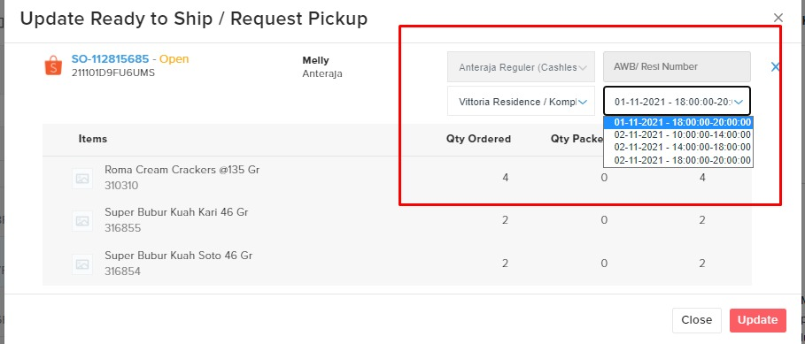

# FAQ - Orders

### **Fitur yang dapat digunakan adalah penambahan dengan menggunakan create sales order secara manual dengan me- screen shoot create SO manual) dan di Forstok k**enapa bisa terjadi Oversell?

Beberapa faktor yang menyebabkan oversell:

1. Stock limitation.\
   Kita sarankan menggunakan fitur priority channel. Fitur ini bertujuan agar SKU tersebut hanya di jual di satu _channel (marketplace)_ saja.\
   [https://docs.forstok.com/knowledge-base/inventory/priority-channel-store](https://docs.forstok.com/knowledge-base/inventory/priority-channel-store)
2. Delay order yang masuk.
3. Expired API token.

### **Kapan proses order (pesanan) memotong stok yang ada di Forstok?**

Proses order (pesanan) akan memotong stok apabila statusnya sudah menjadi _pending payment_ (pembayaran yang tertunda) dan akan masuk ke dalam  _reserved quantity_. Ada beberapa _marketplace_ yang menerapkan sistem _pending payment_ diantaranya adalah, Shopee, Lazada dan Blibli. Namun, untuk _marketplace_ yang tidak menerapkan sistem _pending payment_, maka akan otomatis memotong stok tersebut dari _quantity on hand_. Berikut kami lampirkan dokumentasi _mapping_ order di Forstok. [https://docs.google.com/spreadsheets/d/1N38sX9c57xPJ5o\_2T8Qv8cr41tuHhO\_L1I2T0QHjCiI/edit#gid=0](https://docs.google.com/spreadsheets/d/1N38sX9c57xPJ5o\_2T8Qv8cr41tuHhO\_L1I2T0QHjCiI/edit#gid=0)

### **Apakah jika saya memiliki penjualan lain dari luar **_**ecommerce**_** yang terintegrasi di Forstok, bagaimana menambahkannya agar stoknya bisa tetap berkurang?**

Fitur yang dapat digunakan adalah penambahan dengan menggunakan _create sales order_ secara manual pada menu order yang ada di dashbard Forstok. Berikut kami lampirkan tampilan _create sales order_ di dashboard Forstok.

### **Bagaimana jika status order sudah open (diterima di Tokopedia) lalu mau di cancel dari forstok?**

Saat ini untuk confirm cancel bisa dilakukan langsung melalui seller center tokopedia, karena dari Forstok belum bisa trigger cancel. Jika nanti ordernya sudah di cancel, maka di Forstok statusnya akan mengikuti seller center.

### **Apakah untuk proses order Shopee, seller bisa memilih waktu **_**pick up**_** seperti di seller centernya Shopee?**

Bisa**.** Caranya untuk memproses orderan Shopee harus klik RTS _(Ready To Ship)_ lebih dulu. Maka nanti akan tampil waktu _pick up_ nya.

Setiap _marketplace_ memiliki perbedaan untuk proses ordernya. Beberapa ada yang bisa di print terlebih dahulu seperti Tokopedia, sedangkan untuk Shopee harus RTS lebih dulu agar kita bisa print shipping label.
