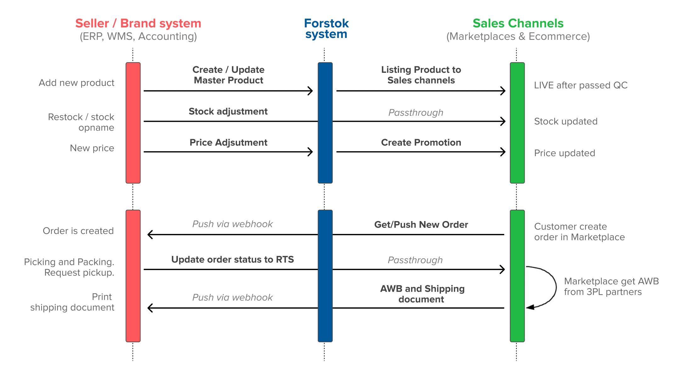

# API Documentation

## High level flow

1. Create master products from ERP to Forstok
2. Stock adjustment from ERP to Sales Channels
3. Price adjustment from ERP to Sales Channels \(Regular price\)
4. New orders from Sales Channel to ERP
5. Update order status from ERP to Sales Channels and get Cashless shipping documents 

**See our API documentation here:** [https://apiseller.forstok.com](https://apiseller.forstok.com/?version=latest)


Contact us from API key access


\*\*\*\*

