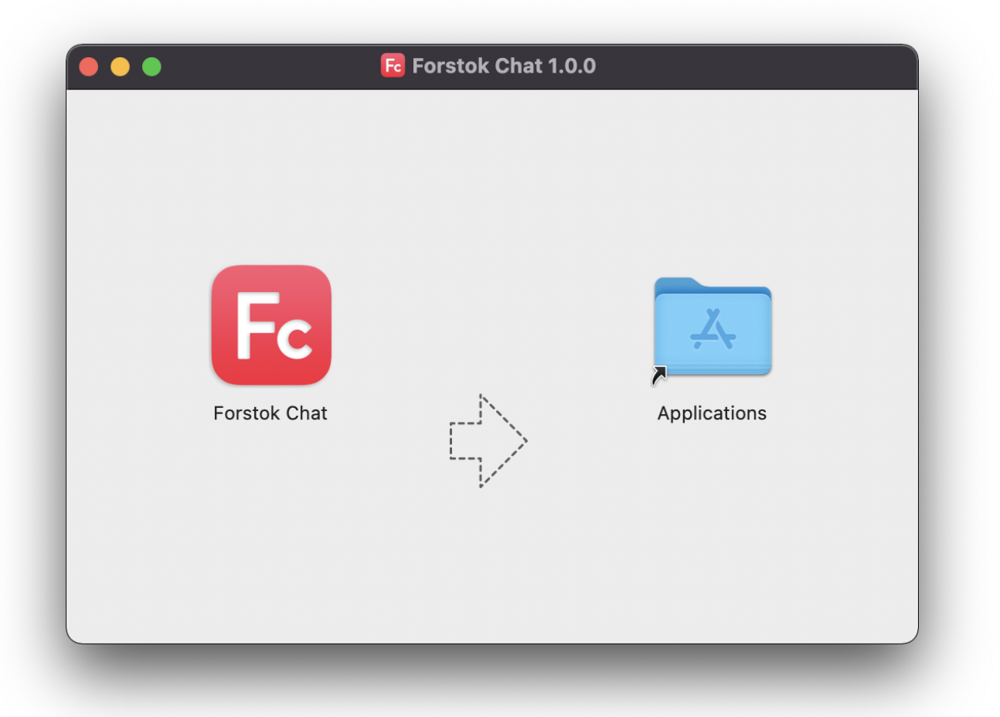
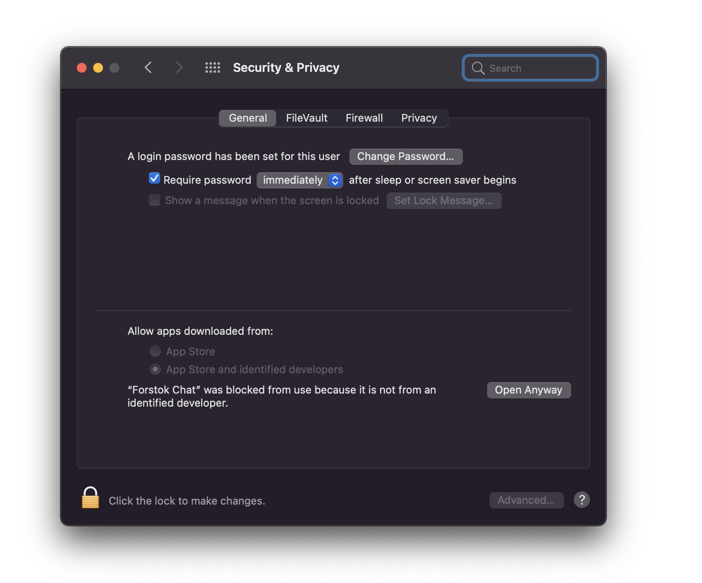

# Download App (Mac)

## Cara Mendownload Forstok Chat (Step-by-step)

Aggregate marketplace chats in one Dashboard.&#x20;

Available chat: Whatsapp, Messenger, Tokopedia, Shopee, JD, Blibli, Lazada, Bukalapak, Shopify

### 1. Download  Mac app&#x20;

Mac: [https://forstokchat.s3-ap-southeast-1.amazonaws.com/Mac/Forstok+Chat-1.0.0.dmg](https://forstokchat.s3-ap-southeast-1.amazonaws.com/Mac/Forstok+Chat-1.0.0.dmg)

### **2. Install App**

**3. Login using Forstok account **

.png>)

**3. Login to each Marketplace store. **

.png>)

#### 4. Add + tab for multiple Forstok account.

.png>)

