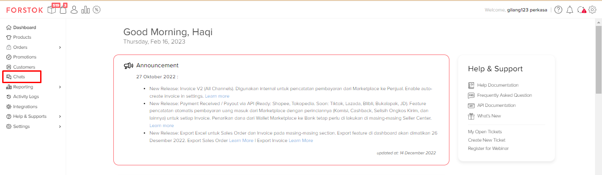
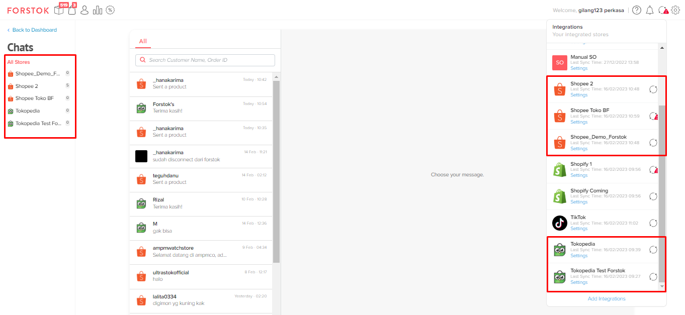
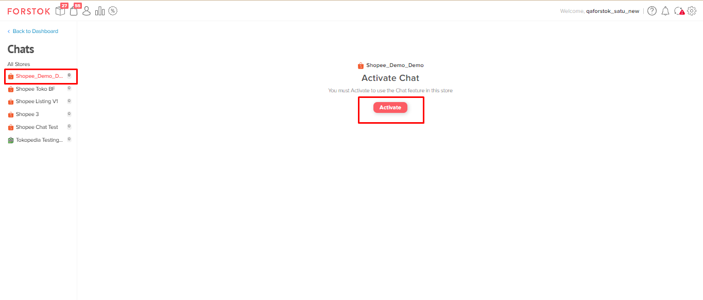
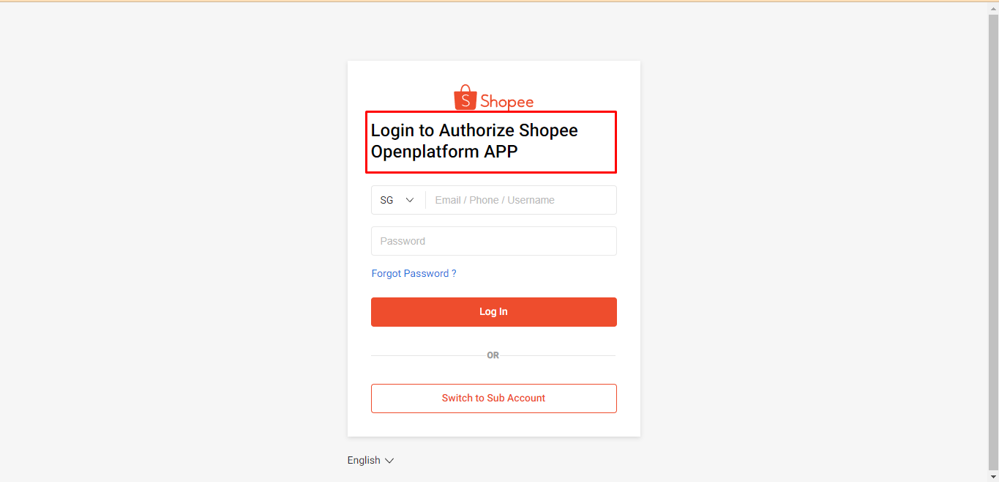
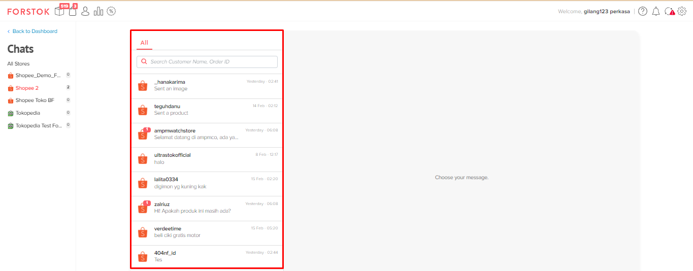
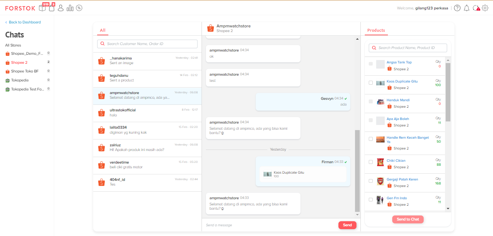
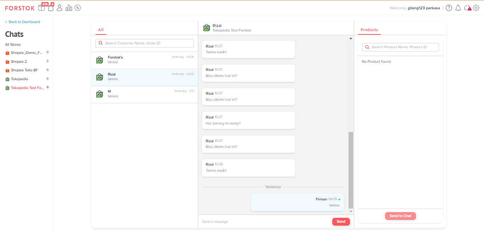

# Forstok Chat (NEW)

### Tampilan Utama (Dashboard)

Forstok chat dapat langsung diakses melalui dashboard setelah seller login melalui akun Forstok.

<figure><figcaption></figcaption></figure>

### Tampilan Forstok Chat

Saat ini marketplace yang sudah dapat terintegrasi dengan Forstok Chat adalah Shopee dan Tokopedia.&#x20;

Bagian sebelah kiri akan disesuaikan dengan jumlah marketplace (Shopee dan Tokopedia) yang sudah berhasil terintegrasi di Forstok.

<figure><figcaption></figcaption></figure>

### Proses Aktivasi

1. User harus melakukan aktivasi terlebih dahulu sebelum menggunakan Forstok Chat.&#x20;

<figure><figcaption></figcaption></figure>

2. Semua chat harus melakukan aktivasi termasuk _Shopee_, harus melakukan login untuk authentification. Tetapi, untuk Tokopedia tidak perlu. Cukup klik activate 1 kali, kemudian selesai.

<figure><figcaption></figcaption></figure>

3. Jika sudah selesai dan berhasil melakukan aktivasi maka sudah dapat menggunakan Forstok chat dengan tampilan berikut ini.

<figure><figcaption></figcaption></figure>

4. Seller sudah dapat menerima dan membalas pesan langsung dari customer dengan tampilan percakapan berikut ini.

<figure><figcaption></figcaption></figure>

5. Jika sudah melakukan aktivasi (klik activate) pada Tokopedia, maka sudah bisa langsung menggunakan Forstok Chat, tidak perlu melakukan authentification.

<figure><figcaption></figcaption></figure>

6. Ketika seller pertama kali melakukan aktivasi Forstok chat, maka sistem Forstok akan mengambil 15 history chat dari customer terakhir dan 30 bubble chat terakhir.&#x20;


**Note: Setelah aktifasi, Forstok akan mengambil 15 chat terakhir dan 30 pesan terakhir dari chat tersebut antara Seller dan Customer. Ini hanya berlaku saat pengaturan di awal untuk membantu Seller dalam perpindahan dari Seller Center ke Forstok Chat. Setelah itu, tidak ada batasan chat yang masuk atau keluar di Forstok. Kami menyarankan untuk selalu menggunakan chat di Forstok agar riwayat chat tetap tersedia jika suatu saat diperlukan.**


<figure><figcaption></figcaption></figure>


**Batasan / Limitasi:**&#x20;

* Tokopedia saat ini  tidak dapat mengirim produk (Karena dari MP nya tidak menyediakan).
* Shopee tidak dapat melihat informasi produk jika customer mengirimkan chat melalui Item Detail yang ada MP, namun akan tampil jika mengirimkan dari List Produk yang di chat.
* Tokopedia memiliki rate limit, sehingga chat akan masuk ke antrian di Forstok.

**Fitur yang akan di develop:**&#x20;

* Sorting list message (Pesan terbaru akan tampil paling atas by default).
* Handle link (Clickable).
* Enter to send message, Shift + Enter to new line.
* Send image (Tokopedia & Shopee).
* Order list (Setiap chatroom akan mempunyai list order yang berbeda-beda jika customer tersebut sudah mempunyai order sebelumnya).
* Setiap chat akan mempunyai status (Mine, Served, Unserved, Resolved).
* Mark as Resolved.

