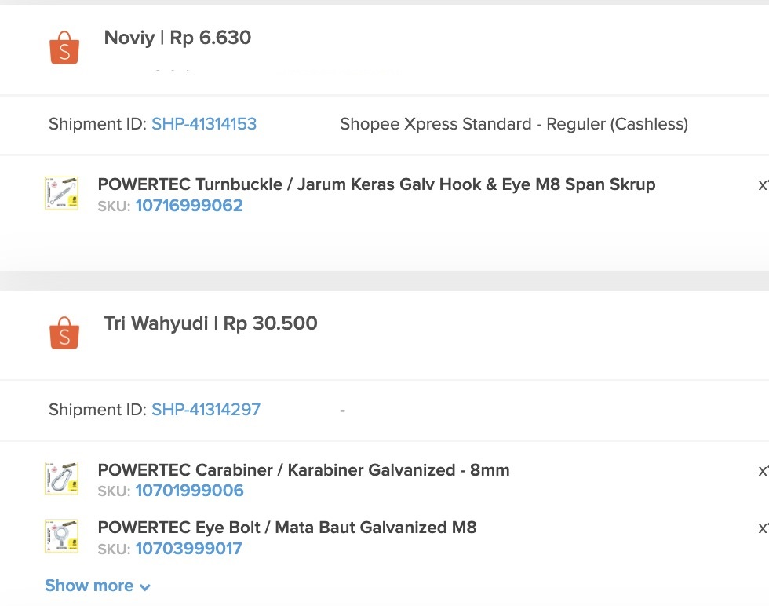

# How to unmasked customer's information on Shopee

Per tanggal 1 Agustus 2022 beberapa marketplace, salah satunya Shopee mengumumkan bahwa mereka akan melakukan _masking_ (penyamaran) pada _shipping label_ (label penjualan) sebagai bentuk perlindungan data konsumen terhadap publik. Dengan diberlakukannya peraturan ini maka, informasi terkait nama, alamat, nomor telepon konsumen akan disamarkan pada label penjualan.

Berikut ini beberapa langkah yang bisa dilakukan apabila penjual masih membutuhkan informasi tersebut terkait kebutuhan mengenai faktur pajak, laporan penjualan, dan lainnya.

### 1. Buka link berikut ini



### 2. Scan barcode yang muncul seperti pada tampilan dibawah ini

<figure><figcaption></figcaption></figure>

Pastikan Anda sudah memiliki aplikasi Shopee di perangkat yang Anda gunakan. Jika belum, silahkan unduh terlebih dahulu aplikasi Shopee melalui App Store atau Google Play.

### 3. Isi dan lengkapi form sesuai dengan informasi yang Anda miliki

<figure><figcaption></figcaption></figure>

Mohon pastikan seluruh data yang Anda isi adalah benar dan sudah sesuai dengan data yang diregistrasikan pada Shopee.


Pihak Shopee akan melakukan verifikasi dan validasi secara manual ketika Anda sudah melengkapi dan mengikuti langkah pertama sampai langkah ketiga. Mohon untuk menunggu sampai Anda mendapatkan informasi dari pihak Shopee.


### 4. Berhasil disetujui

<figure><figcaption></figcaption></figure>

Jika sudah disetujui oleh pihak Shopee, maka Anda tidak akan mendapatkan masking (penyamaran) pada label penjualan Anda.
