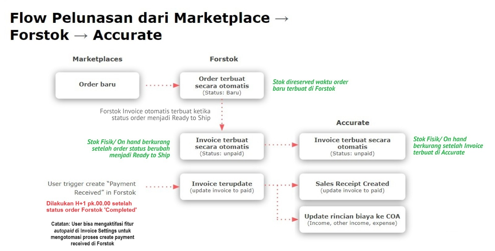

# Integrasi Accurate Online


File ppt panduan integrasi Accurate di Forstok:

[https://docs.google.com/presentation/d/1m7M\_fjCxfwl0-y-GSk5LiJtuoc64-oYBTydcj4rOg3g/edit?usp=sharing](https://docs.google.com/presentation/d/1m7M\_fjCxfwl0-y-GSk5LiJtuoc64-oYBTydcj4rOg3g/edit?usp=sharing)


<figure><figcaption></figcaption></figure>


**Existing User Accurate**

1. Integrasikan channel/marketplace ke forstok
2. Pastikan SKU di forstok tidak ada pending action (hal ini penting karena nanti ketika klik sync item, forstok akan mengirim seluruh data sku yang ada di forstok, termasuk SKU yang masih di pending actions);
3. Integrasikan accurate di forstok;
4. Mapping CoA dan WH Accurate di Forstok;
5. Aktifasi fitur Invoice Forstok serta fitur Auto Paid (apabila sesuai dengan kebutuhan)
6. Klik Sync item forstok --> Accurate;
7. Klik Sync stock Accurate --> Forstok

**New User Accurate**

1. Integrasikan channel/marketplace ke forstok
2. Pastikan SKU di forstok tidak ada pending action (hal ini penting karena nanti ketika klik sync item, forstok akan mengirim seluruh data sku yang ada di forstok, termasuk SKU yang masih di pending actions);
3. Integrasikan accurate di forstok;
4. Mapping CoA dan WH Accurate di Forstok;
5. Aktifasi fitur Invoice Forstok serta fitur Auto Paid (apabila sesuai dengan kebutuhan)
6. Klik Sync item forstok -> Accurate;
7. Penyesuaian Persediaan/Stok Opname di Accurate
8. Klik Sync stock Accurate -> Forstok



**Stock berkurang di accurate berdasarkan invoice, dengan demikian langsung memotong stok on hand/fisik. Begitu juga dengan di Forstok, kalau order RTS itu juga sudah memotong stok on hand.**

**Pastikan nama produk dan kode sku disamakan antara forstok dan accurate, kondisi nama produk dan sku berbeda akan mengakibatkan error ketika proses create invoice di accurate dan sync stock dari accurate ke forstok.**


1. **Add Integration > Choose “Accurate” > Click “Connect”**

[https://www.forstok.com/integrations](https://www.forstok.com/integrations)

2**. Login User & password Accurate**


**Pastikan integrasi dilakukan dengan email owner/ akun utama, penggunaan email lain/nomor handphone akan mengakibatkan gagalnya proses integrasi**


3\. **Klik "Beri Akses"**

4\. **Select “Database “ > Click “Save”**

 (1) (1).png>)


1. data order yang di kirim ke accurate order setelah integrasi Accurate to forstok
2. Untuk ganti database harus integrasi ulang. Disconnect Accurate di Forstok


5. Generate API Token Accurate

*   Klik “Pengaturan” > Accurate Store > Aplikasi Saya\

    Input App Key Forstok\
    8fa12c9c-8cc3-4461-a335-8e61e1448e6f
* Kemudian klik 'Install Aplikasi'

<figure><figcaption></figcaption></figure>

* Klik “API Token” > Buat API Token

<figure><figcaption></figcaption></figure>

* Copy “API Token” > Infokan ke Tim Forstok

<figure><figcaption>
Apabila tidak memiliki jalur komunikasi langsung, bisa create ticket melalui fitur Create Ticket di Dashboard Forstok
</figcaption></figure>
