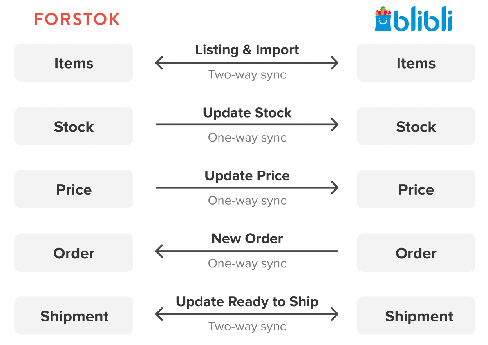

# Blibli


**Penting!**  Sebelum integrasi, pasti kan product yang sama di toko/ channel lain mempunyai Kode SKU yang sama. Setelah integration, product akan di import dan terlinking dengan product yang sama mengunakan Kode SKU.


## Cara Integrasi Blibli (Step-by-step)

<figure><figcaption></figcaption></figure>

1. Log in ke seller center Blibli [https://seller.blibli.com/MTA/store-info/store-info](https://seller.blibli.com/MTA/store-info/store-info). Pada kanan atas pilih **Pengaturan Seller API**

<figure><figcaption></figcaption></figure>

2. Pada **Kata sandi API** klik **Buat** .&#x20;


**Pastikan kata sandi khusus di kosongkan**, apabila terisi dapat menyebabkan error 'Seller id not recognized' ketika akan memproses integrasi di Forstok.


<figure><figcaption></figcaption></figure>

3. Pada baris '**ID API Klien'** copy and paste teks berikut:&#x20;

&#x20;      'mta-api-ptforstokteknologiindonesia-9ddf9'

&#x20;      Klik sambungkan, pastikan tampilan sudah seperti gambar di atas.

3\. Kembali ke Forstok. Pilih Integration > Add Integrations > Pilih Blibli\

.png>)

4\. Input API seller key dan Merchant ID

MTA Username (Email): _Email log in seller center Anda_\
API Seller Key: _copy paste yang di dapat dari seller center_\
Merchant ID: _copy paste yang di dapat dari seller center_

 (1) (1).png>)

 (1) (1).png>)

5\.  Pilih **Sync Products from Blibli**  > lalu pilih **Next** > **Finish**

6\. Maka sudah berhasil terintegrasi ke Blibli dan proses import item.

