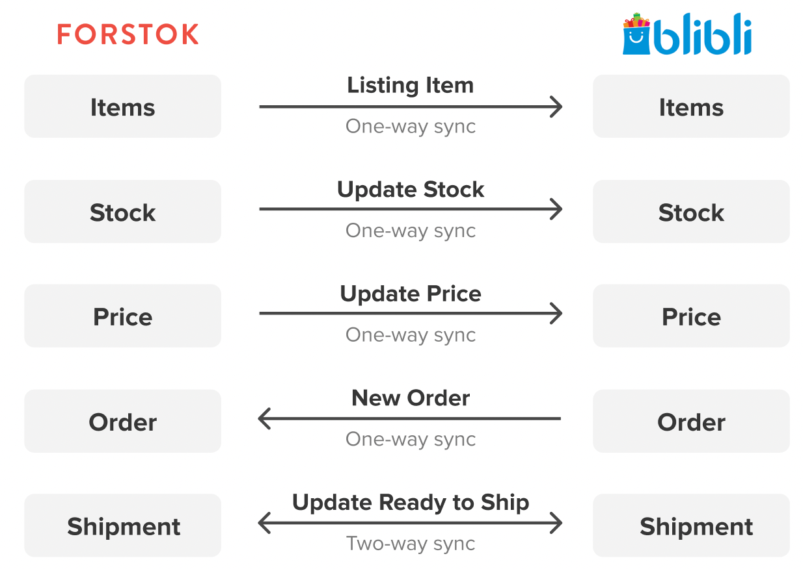

# Blibli


**Penting!**  Sebelum integrasi, pasti kan product yang sama di toko/ channel lain mempunyai Kode SKU yang sama. Setelah integration, product akan di import dan terlinking dengan product yang sama mengunakan Kode SKU.


## Cara Integrasi Blibli \(Step-by-step\)

1. Log in terlebih dahulu ke seller center Blibli [https://seller.blibli.com/MTA/store-info/store-info](https://seller.blibli.com/MTA/store-info/store-info). Kita perlu set up API terlebih dahulu. Pada kanan atas pilih **Pengaturan Seller API**

2. Pada **Kata sandi API** klik **Buat** . Untuk Kata sandi khusus di kosongkan.

3. Pada **ID API Klien** input:  
ID API Forstok yaitu: mta-api-ptforstokteknologiindonesia-9ddf9  
Lalu klik **hubungkan**

4. Kembali ke Forstok. Pilih Integration &gt; Add Integrations &gt; Pilih Blibli  

5. \`Input API seller key dan Merchant ID  
API Seller Key: _copy paste yang di dapat dari seller center_  
Merchant ID: _copy paste yang di dapat dari seller center_

Cara melihat merchant ID:  
- Kembali ke seller center. Pada kanan atas pilih **Info Toko**.

- Copy **ID Seller** ke kolom integrasi Forstok.

5. Input pada kolom berikut. Lalu klik **Install**

6.  Pilih **Sync Products from Blibli**  &gt; lalu pilih **Next** &gt; **Finish**

7. Setelah berhasil integtasi, kembali ke halaman item akan muncul pop-up reconnect Blibli. Klik reconnect

8. Input email dan password Blibli, lalu klik save. Setelah tidak ada pop up reconnect. Maka Blibli berjasil terconnect kembali.  

9. Maka sudah berhasil terintegrasi ke Blibli dan proses import item.

