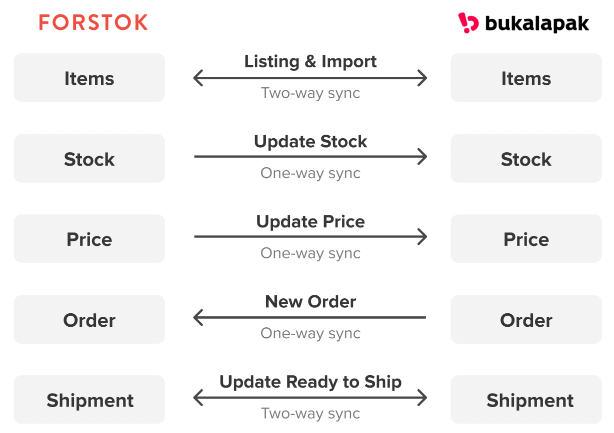

# Bukalapak


**Penting!**  Sebelum integrasi, pasti kan product yang sama di toko/ channel lain mempunyai Kode SKU yang sama. Setelah integration, product akan di import dan terlinking dengan product yang sama mengunakan Kode SKU.


## Cara Integrasi Bukalapak \(Step-by-step\)

1. Di pastikan sudah Log in juga di seller center Bukalapak

2. Pilih menu Integrations &gt; pilih Add Integrations 

3. Klik View/Connect untuk integrasikan Bukalapak.

4. Karena sudah log di seller center Bukalapak jadi sudah otomatis terintegrasi. Tinggal pilih _**Sync Products from Bukalapak**  &gt;_ lalu pilih _**Next**_ &gt; _**Finish**_

5. Maka sudah berhasil terintegrasi ke Bukalapak dan proses import item


`Berhubung integrasi Bukalapak ini otomatis. Jadi jangan log in toko lain selain Bukalapak yang di integrasikan ke Forstok, karena akan mengakibatkan me-replace API yang sesuai toko lain tsb.`


