# JD.ID

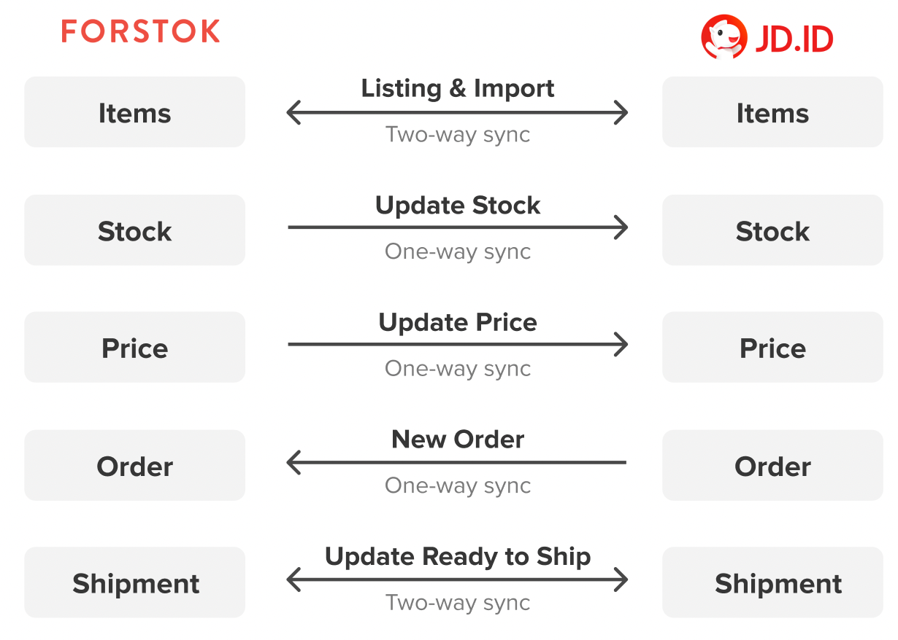


**Penting!**  Sebelum integrasi, pastikan product yang sama di toko/ channel lain mempunyai Kode SKU yang sama. Setelah integration, product akan di import dan terlinking dengan product yang sama mengunakan Kode SKU.


## Cara Integrasi JD.ID (Step-by-step)

Sebelum integrasi ke JD.ID pastikan toko Anda sudah **Qualified Seller.** Karena JD.ID Open API khusus untuk seller yang sudah Qualified Seller. Jika masih Basic Seller harap mengupgrade Toko Anda atau mendaftar menjadi Qualified Seller.\
****Untuk mendaftar menjadi Qualified Seller bisa dilihat di link berikut:\
****[https://www.jd.id/blog/segera-update-toko-Anda-jadi-qualified-untuk-keuntungan-berlipat\_194.html](https://www.jd.id/blog/segera-update-toko-Anda-jadi-qualified-untuk-keuntungan-berlipat\_194.html)


1. Log in ke akun JD.ID seller [https://seller.jd.id/](https://seller.jd.id/)
2. Log in ke dev console jd.id [https://open-console.jd.id/](https://open-console.jd.id/)

Untuk URL Callback menggunakan link berikut : [https://www.forstok.com/dashboard/channels/integrations/jd/setup](https://www.forstok.com/dashboard/channels/integrations/jd/setup)


1 Log in ke ke seller center JD.ID [https://seller.jd.id/](https://seller.jd.id/) input email dan password Anda.\

2\. Log in ke dev console JD.ID menggunakan akses seller center tadi (ini untuk mendapatkan API JD.ID)\

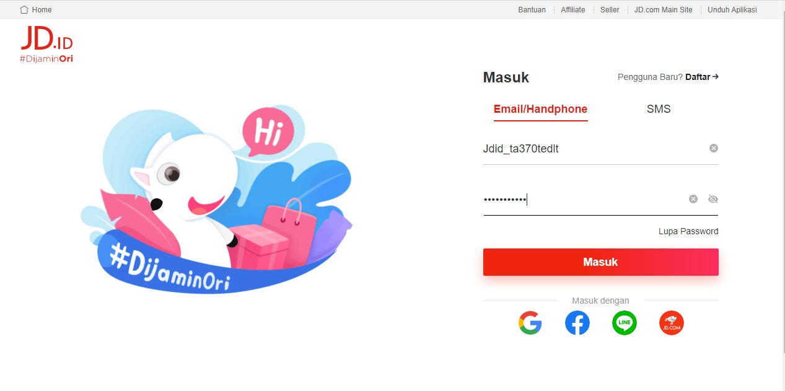

3\. Centang input data JD.ID sesuai data yang Anda daftarkan saat Buka Toko, setelah semua terisi lalu pilih Register\

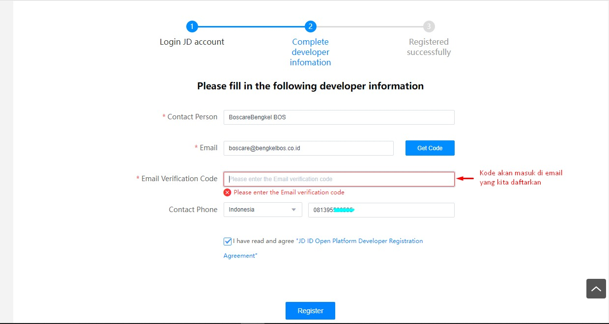

4\. Pilih create App\

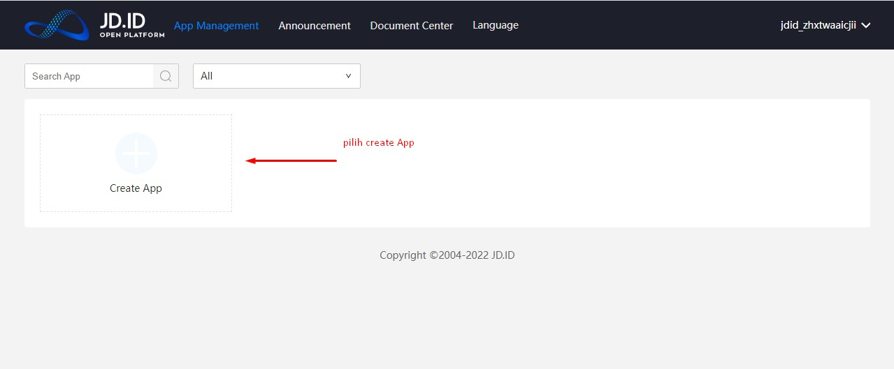

5\. Pada seller to JD.ID buka dropdown

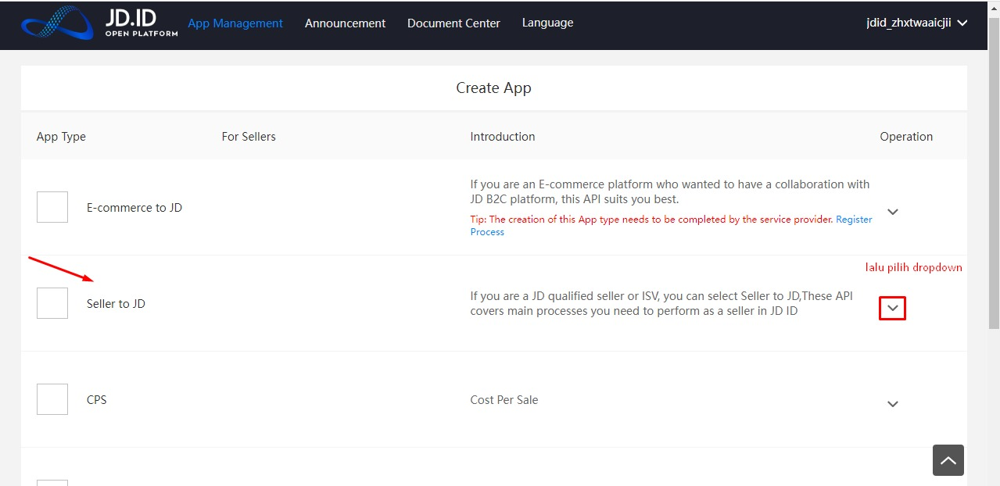

6\. Pada normal standard API pilih Create App\

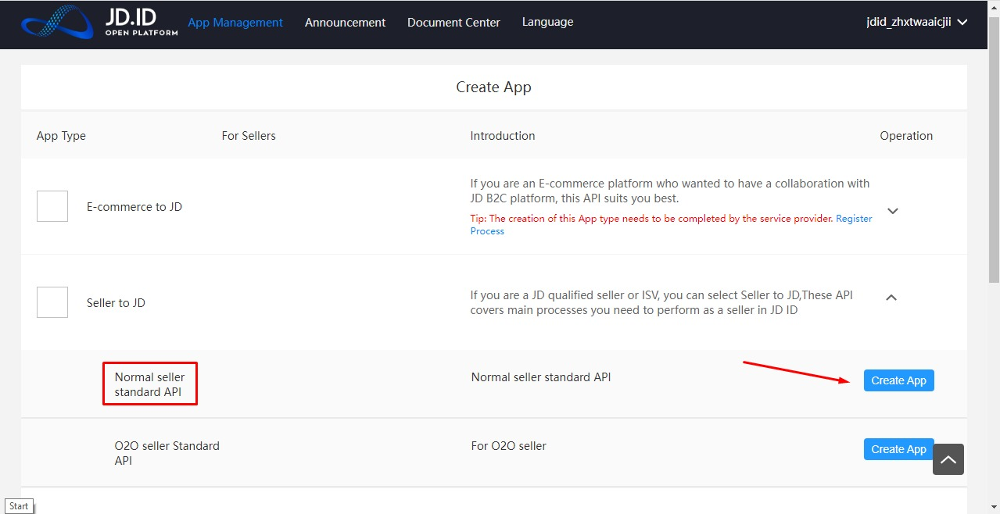

7\. Create App pada App Name input Nama Toko Anda di JD.ID

.png>)

8\. Pilih publish App

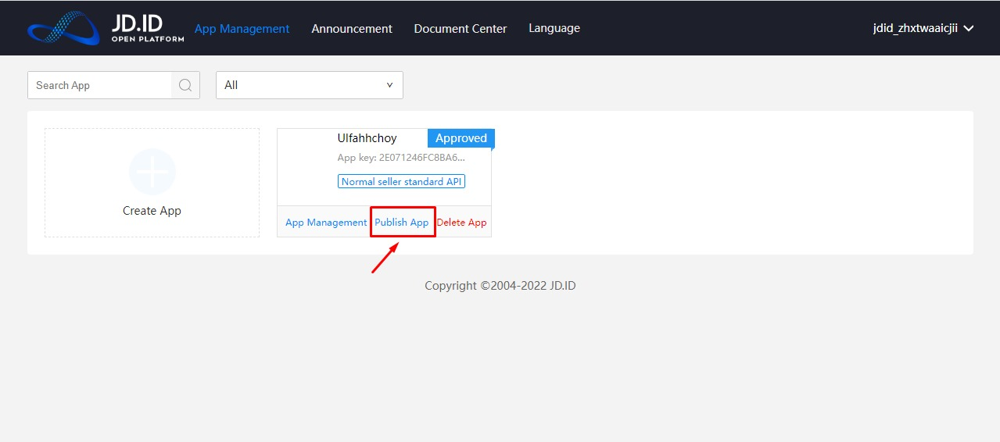

9\. Pilih App Management\
****

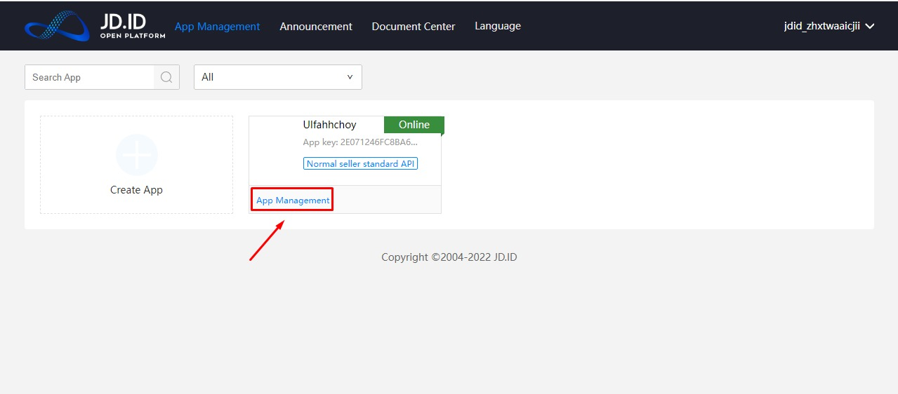

10\. PIlih App Setting\
Input URL Callback pada \*Callback URL:

[https://www.forstok.com/dashboard/channels/integrations/jd/setup](https://www.forstok.com/dashboard/channels/integrations/jd/setup)

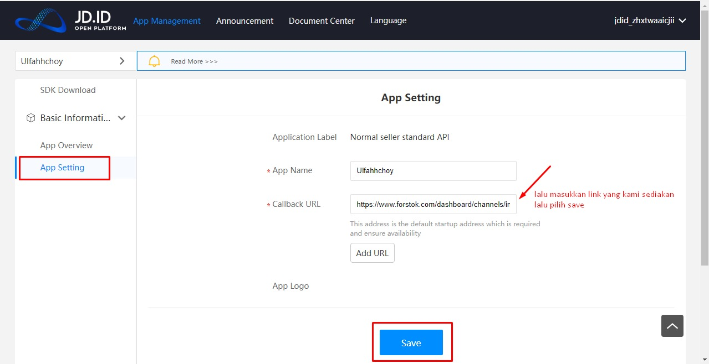

11\. Masuk ke akun Forstok Anda, kita mulai integrasikan API JD.ID ke Forstok.\
Pilih integration pada kanan atas, lalu pilih Add Integration. Lalu pilih JD.ID

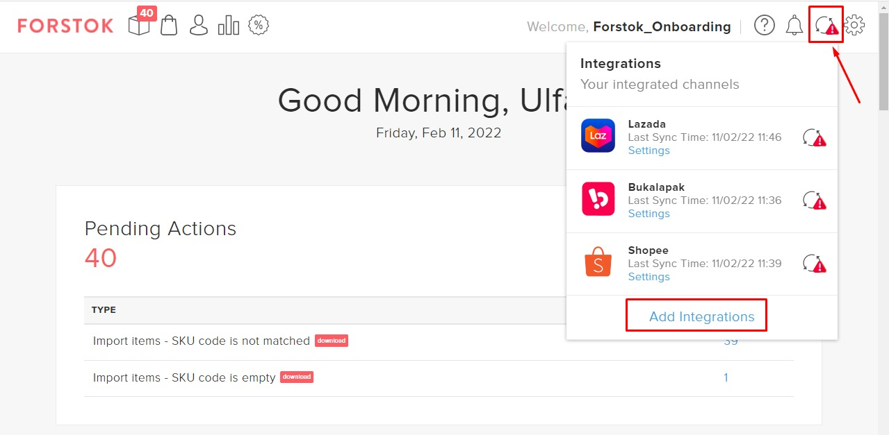

.png>)

12\. Input Shop ID, API Key, API Secret yang di dapat dari dev console JD.ID tadi.

Shop ID (dari seller center JD.ID [https://seller.jd.id/](https://seller.jd.id/)): Shop Information / Informasi Toko, copy paste shop id / id toko pada bagian yang ditandai.

API Key dan API Secret (dari dev console https://open-console.jd.id/)

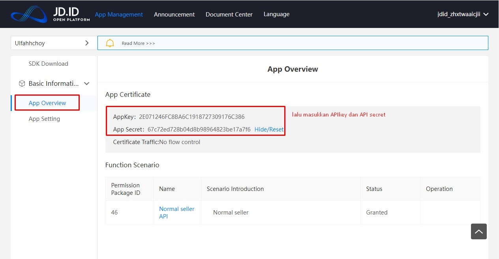

13\. Sudah diinput semua, klik install

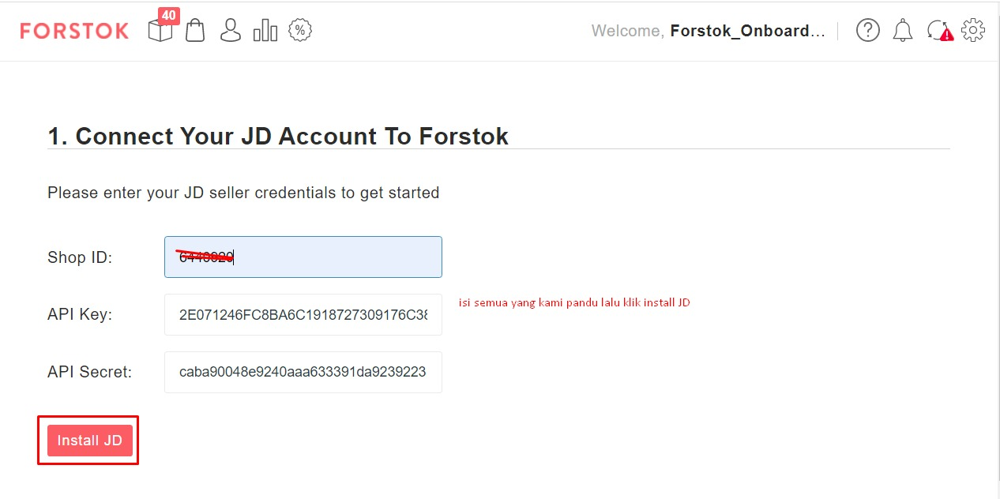

\

14\. Klik Log in\

.jpeg>)

15\. Pilih Next\
****

.jpeg>)

16\. Klik Finish, Pop up sebelah kanan atas, menginformasikan jika sedang proses import item JD.ID\
****\
****

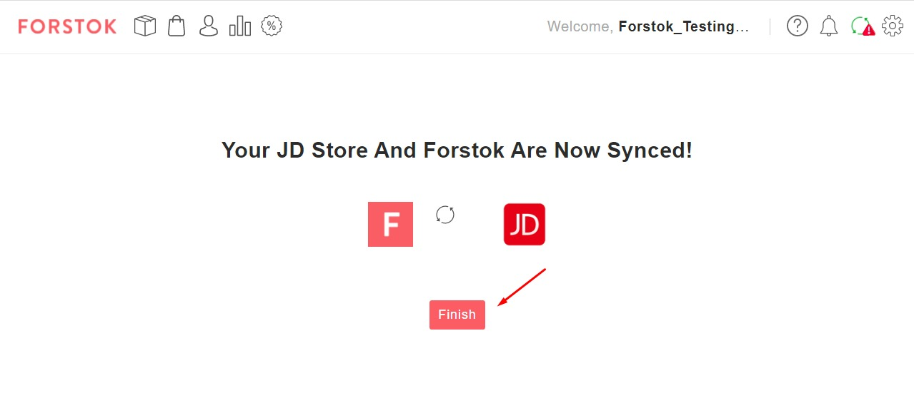

17\. JD.ID berhasil di integrasikan\
Note:saat awal di integrasikan sync Export masih Off, harap aktifkan/On terlebih dahulu jika JD.ID mulai update stock, listing, update harga dari Forstok

.jpg>)


**Forstok hanya akan mengimport item dengan status audit lolos / lulus qc**, pastikan item yang akan diimport ke forstok sudah memiliki status yang sesuai.


