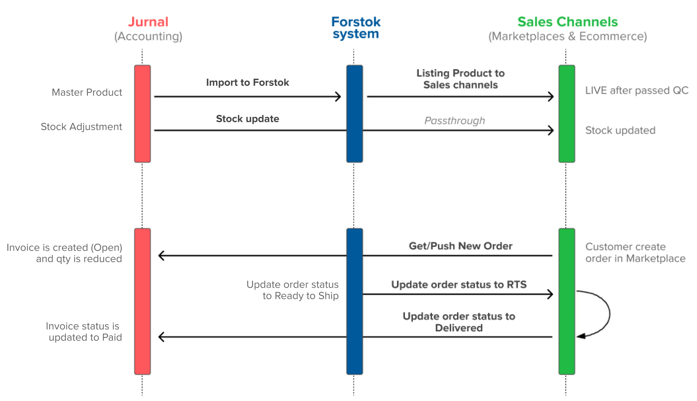

# Jurnal Accounting

Jurnal merupakan sistem akuntansi yang memudahkan Anda dalam mengelola laporan penjualan Anda. Dengan menghubungkan Jurnal ke Forstok semua transaksi orderan Online Anda bisa masuk ke Software Jurnal Anda. Sehingga Anda dapat mengelola laporan keuangan Offline dan Online jadi lebih mudah dan efisien.


Integrasi Jurnal hanya bisa digunakan sebagai pencatatan akunting. Sangat tidak disarankan untuk e-commerce operasional dimana membutuhkan real-time stok sync.&#x20;

Stock Sync dari Jurnal ke Forstok harus dilakukan melalui menekan Sync stock secara manual.&#x20;



<mark style="color:red;">Untuk integrasi ke Jurnal pastikan akun Jurnal yang connect ke Forstok adalah owner account bukan sub account.</mark>


### Onboarding steps

1. Integration Steps. [View here](integrasi-jurnal.md)
2. Jurnal Settings - Mapping COA and gudang. [View here](pesanan-penjualan-ke-faktur-chart-of-accounting-mapping.md)
3. How to import product from Jurnal to Forstok. [View here](pedoman-penggunaan-jurnal-di-forstok.md)
4. Stock adjustment and sync from Jurnal to Forstok (Manual Sync). [View here](sinkronisasi-stok-jurnal-ke-forstok.md)
5. Order sync from Forstok to Jurnal. [View here](sinkronisasi-order-forstok-ke-jurnal.md)
6. Jurnal FAQ. [View here](faq-jurnal.md)

### **Order Mapping Forstok ke Jurnal**

| **Forstok**     | **Jurnal**                                                                                                                                                                                      |
| --------------- | ----------------------------------------------------------------------------------------------------------------------------------------------------------------------------------------------- |
| Pending Payment | 
Create invoice status unpaid di Jurnal untuk potong stok. 

<em>Ini untuk orderan MP yang mempunyai status order pending payment seperti Shopee, Tokopedia, Lazada, etc</em>
 |
| Open            | Create invoice status unpaid di Jurnal untuk potong stok.                                                                                                                                       |
| Printed         | -                                                                                                                                                                                               |
| Ready to Ship   | -                                                                                                                                                                                               |
| Shipped         | -                                                                                                                                                                                               |
| Delivered       | Update invoice jadi Paid di jurnal                                                                                                                                                              |
| Cancelled       | Invoice akan di delete secara otomatis di Jurnal                                                                                                                                                |
| Returned        | Marketplace belum memprovide API return. Jadi harus create sales return di Accurate secara manual.                                                                                              |

Untuk integrasi ke Jurnal ada 2 kebutuhan yaitu:\
1\. Transaksi order masuk ke Jurnal\
2\. Upate stock via Jurnal dan import product master via Jurnal ke Forstok
