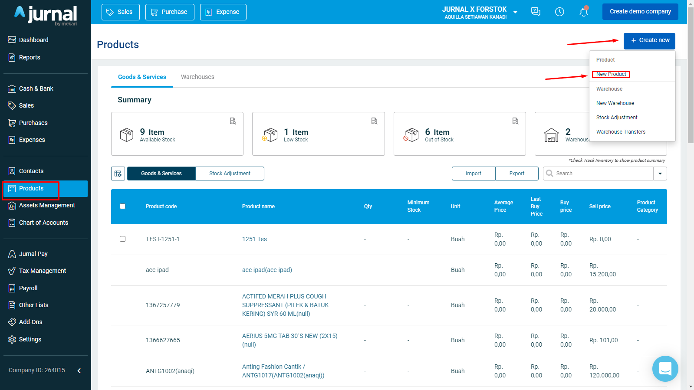
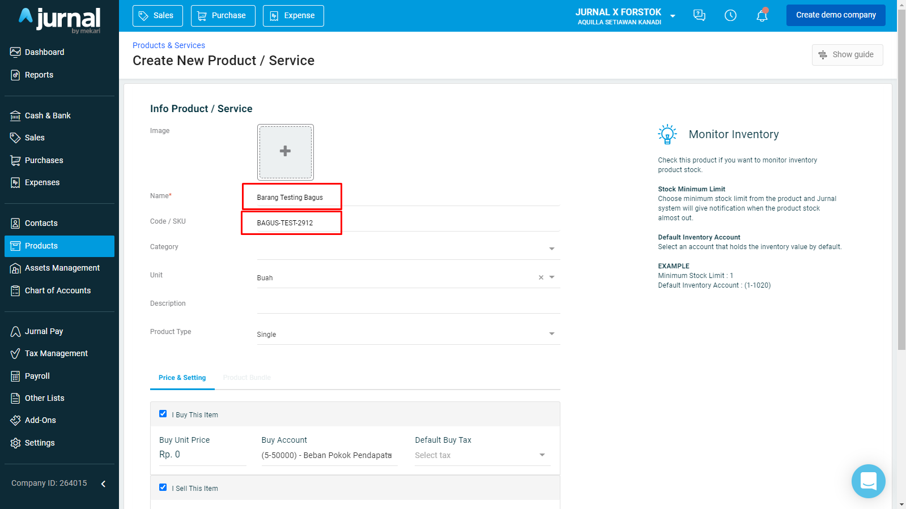
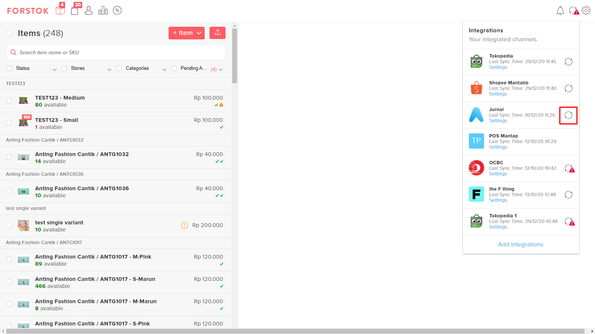
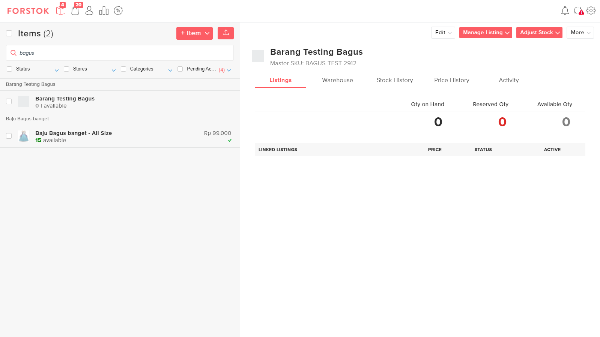

# Produk Import (Jurnal ke Forstok)

Membuat Produk pada Jurnal:

* Klik "Products" pada menu sebelah kiri.
* Klik "Create new" dan pilih "New Product".
* Anda akan dialhikan pada halaman membuat produk.

* Isi form pembuatan produk

* Isi harga barang pada kolom unit price.
* Stock Tracking harus di centang agar dapat melakukan penyesuaian stock dari Jurnal ke Forstok. Klik  tombol "Create Product" dan produk baru akan terbuat.

.png>)

* Kemudian klik tombol "Import produk" untuk mengimpor produk dari Jurnal yang belum terdaftar di Forstok. **Menambahkan produk baru di Jurnal tidak akan otomatis menambahkan produk di Forstok. **Ulangi langkah “Impor produk” ini setiap kali Anda menambahkan produk baru di Jurnal.

* Setelah proses sinkronisasi selesai, produk dapat ditemukan di menu item Forstok.

