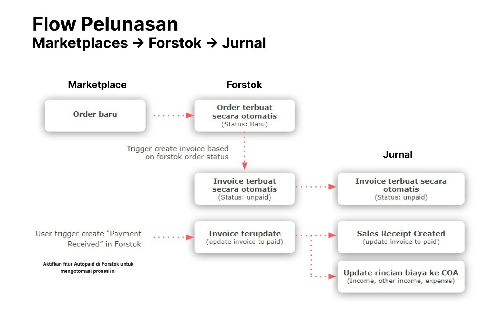

# Sinkronisasi Invoice (Forstok → Jurnal)


**Aktifasi fitur invoice di Forstok terlebih dahulu, berikut panduannya:** [**Panduan Invoice**](../../sales-invoices/invoice-settings.md)


<figure><figcaption></figcaption></figure>

### **Field Mapping**

| **Forstok Invoice**  | **Jurnal Invoice/ Faktur** |
| -------------------- | -------------------------- |
| Channel / Store      | Nama pelanggan             |
| Channel / Store      | Tag                        |
| Marketplace Order ID | No. referensi pelanggan    |

### Faktur akan dibuat di Jurnal .&#x20;

Faktur di Jurnal akan dibuat dan ditandai sebagai dibayar secara otomatis berdasarkan status invoice di Forstok. Pembayaran yang diterima akan dipetakan berdasarkan COA.


Nama pelanggan di Jurnal akan menggunakan Channel/Store name. contoh Tokopedia - Mybabystore. Sesuai nama toko di Forstok


.png>)

### Faktur penjualan dari orderan Marketplace:

<figure><figcaption>
Invoice di Jurnal dengan detail payment received Forstok
</figcaption></figure>
