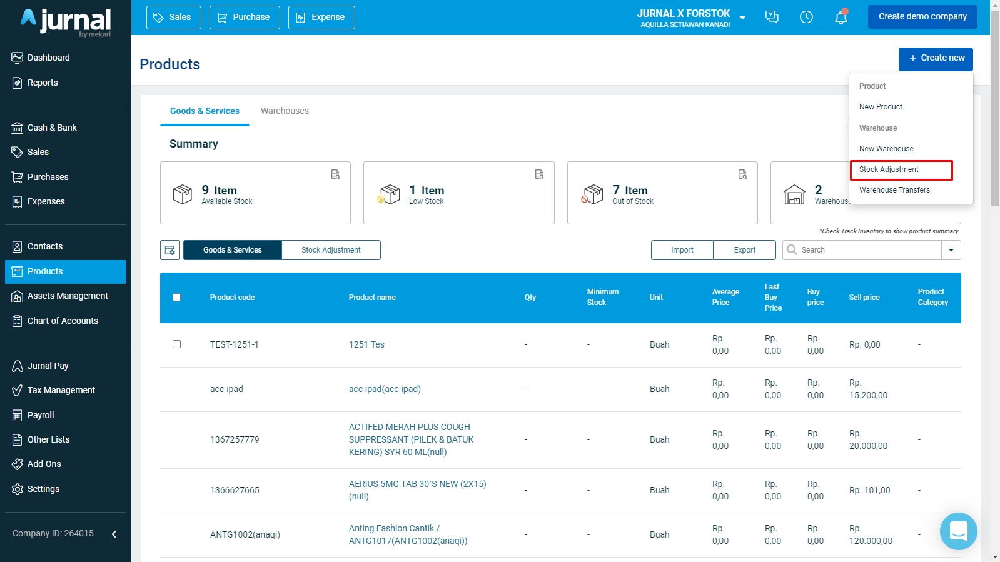
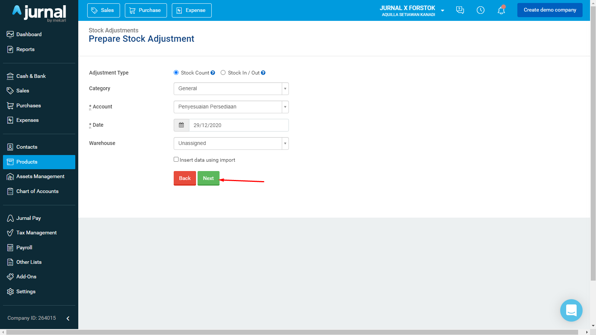
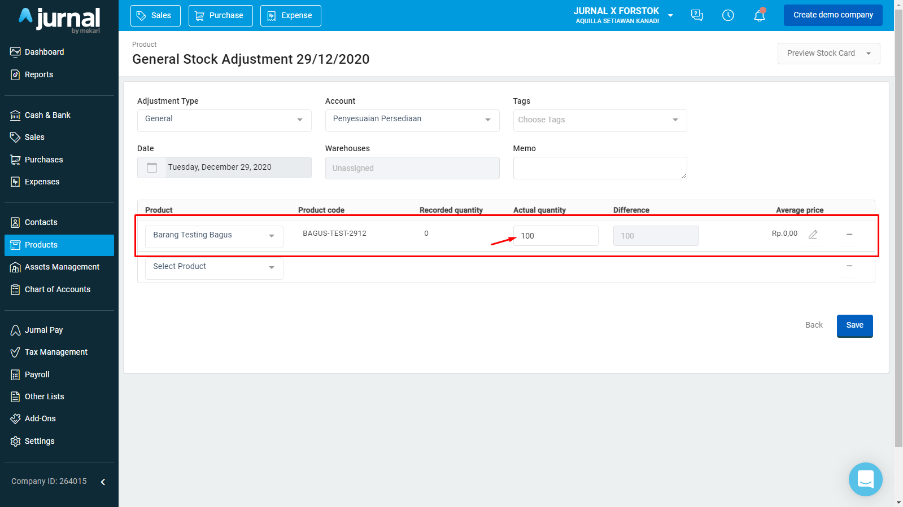
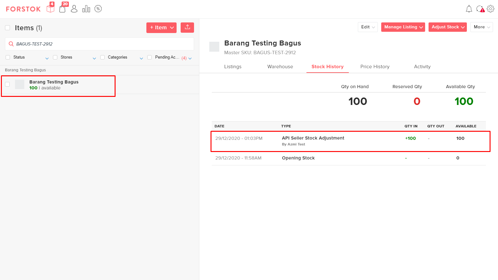

# Sinkronisasi stok (Jurnal → Forstok)

### 1. AKTIFKAN SINKRONISASI STOK DARI JURNAL

Instal aplikasi Forstok terlebih dahulu untuk melakukan sinkronisasi stok dari Jurnal ke Forstok

* Login ke Jurnal&#x20;
* Instal Forstok App [https://my.jurnal.id/appstore/forstok-191221](https://my.jurnal.id/appstore/forstok-191221)
* Sekarang Anda bisa mengupdate stok dari Jurnal. [https://my.jurnal.id/stock\_adjustments/setup](https://my.jurnal.id/stock\_adjustments/setup)

Catatan:&#x20;

Sinkronisasi stok hanya satu arah dari Jurnal ke Forstok. Memperbarui stok di Forstok, tidak akan memperbarui stok di Jurnal.

Cara melakukan stock adjustment di Jurnal:\
Pastikan "I Track Stock for This Item" di tiap produk Jurnal sudah di centang

.png>)

* Klik "Products" pada menu sebelah kiri.
* Klik "Create new" dan pilih "Stock Adjustment".
* Setelah itu akan pindah ke halaman stock adjustment.

* Klik Next.

* Pilih produk yang ingin anda ubah jumlah stoknya.
* Masukan jumlah stoknya. "Actual stock" adalah stok final yang akan diguanakan sebagai stok baru pada item yang ada di Forstok.
* Klik Next.

.png>)

* Stok yang sudah diupdate di Jurnal akan diupdate di Forstok.
* Perubahan stok akan tercatat pada tab Stock History.

