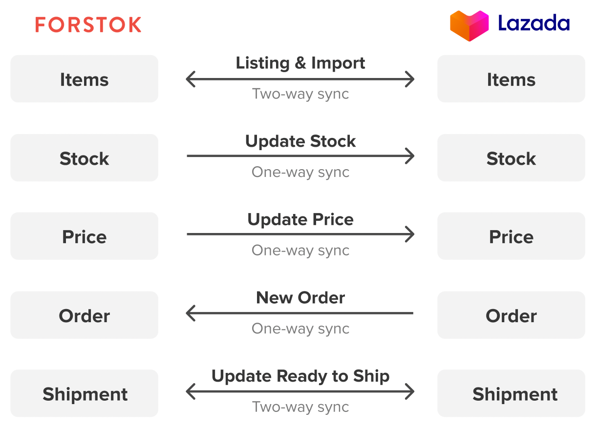

# Lazada


**Penting!**  Sebelum integrasi, pastikan product yang sama di toko/ channel lain mempunyai Kode SKU yang sama. Setelah integration, product akan di import dan terlinking dengan product yang sama mengunakan Kode SKU.


## Cara Integrasi Lazada (Video)


****


1. Pilih Menu Integration > Pilih Add integrations.
2. Klik view untuk integrasikan Lazada.
3. Input akses log in Lazada, lalu klik submit.
4. Pada Product Catalog pilih **Sync Product from Lazada** >**Next** > pilih Finish.
5. Lazada berhasil integrasi ke Forstok dan sedang proses import produk.


Waktu import product dari Lazada tergantung dari jumlah product.


## Cara Integrasi Lazada (Step-by-step)

1\. Pilih menu Integrations > pilih Add Integrations

.png>)

2\. Klik View untuk integrasikan Lazada.

.png>)

[\
](https://s3.amazonaws.com/cdn.freshdesk.com/data/helpdesk/attachments/production/48062572994/original/VAz3XK3s1NDWKHiptEuteE-zA0yqniyYyw.png?1601813140)3. Input akses log in Lazada, lalu klik submit.

.png>)

4\. Pada Product Catalog pilih **Sync Product from Lazada --**>Next --> pilih Finish[****\
****](https://s3.amazonaws.com/cdn.freshdesk.com/data/helpdesk/attachments/production/48062573182/original/0SKkm5a4yXlLWiB54-yYVmjgbQ6Hja68Vw.png?1601813500)

.png>)

5\. Lazada berhasil integrasi ke Forstok dan sedang proses import produk.

.png>)
