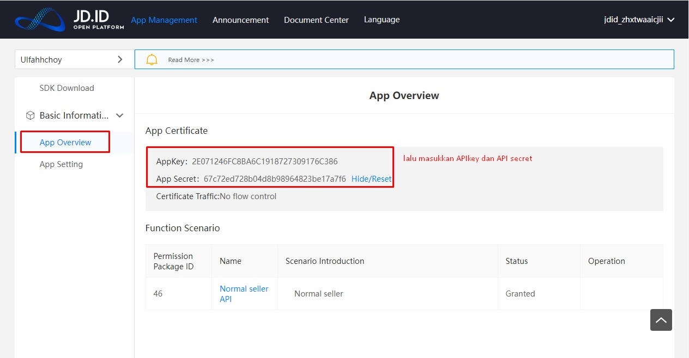

# Reconnect JD.ID

1. Untuk reconnect channel JD.ID, klik Integrations, kemudian Settings

2\. Klik Update Channel, kemudian OK

3\. Ikuti langkah pada [https://docs.forstok.com/knowledge-base/integrations/jd.id](https://docs.forstok.com/knowledge-base/integrations/jd.id) untuk mendapatkan Shop ID, API key, dan API Secret, kemudian klik Install JD.

