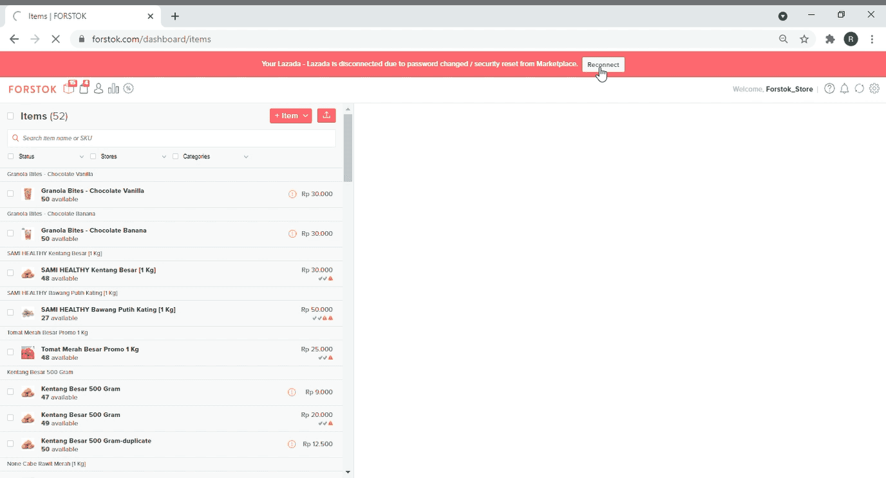

# Reconnect Lazada

## Video

1. Pada menu item di Forstok akan muncul pop-up re-connect Lazada. Pilih Update Password

.png>)

2\. Input akses Lazada. Maka Lazada akan otomatis terhubung kembali

.png>)
