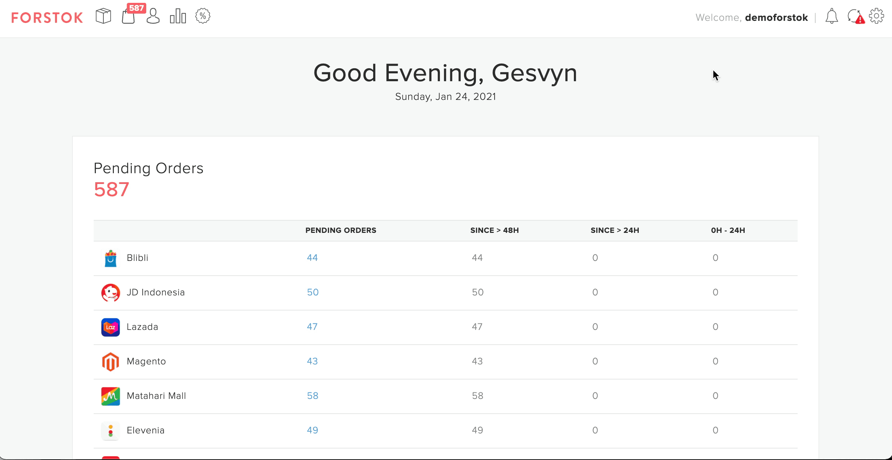

# Shopee

## Cara Integrasi Shopee \(Video\)


**Penting!**  Sebelum integrasi, pastikan product yang sama di toko/ channel lain mempunyai Kode SKU yang sama. Setelah integration, product akan di import dan terlinking dengan product yang sama mengunakan Kode SKU.


1. Pilih Menu Integration &gt; Pilih Add integrations.
2. Klik view untuk integrasikan Shopee.
3. Input akses log in Shopee, lalu klik submit.
4. Pada Product Catalog pilih **Sync Product from Shopee** &gt;**Next** &gt; pilih Finish.
5. Shopee berhasil integrasi ke Forstok dan sedang proses import produk.

## Cara Integrasi Shopee \(Step-by-step\)

1. Pilih menu Integrations &gt; pilih Add Integrations

2. Klik View untuk integrasikan Shopee

3. Input akses log in Shopee, jangan lupa origin di ganti menjadi Indonedia atai **ID**. Lalu klik **Log In**  

4. Pilih COnfirm Authorization

5. Pada Product Catalog pilih **Sync Product from Shopee** &gt;**Next** &gt; pilih Finish 

5. Maka Shopee berhasil integrasi ke Forstok dan sedang proses import produk. 

