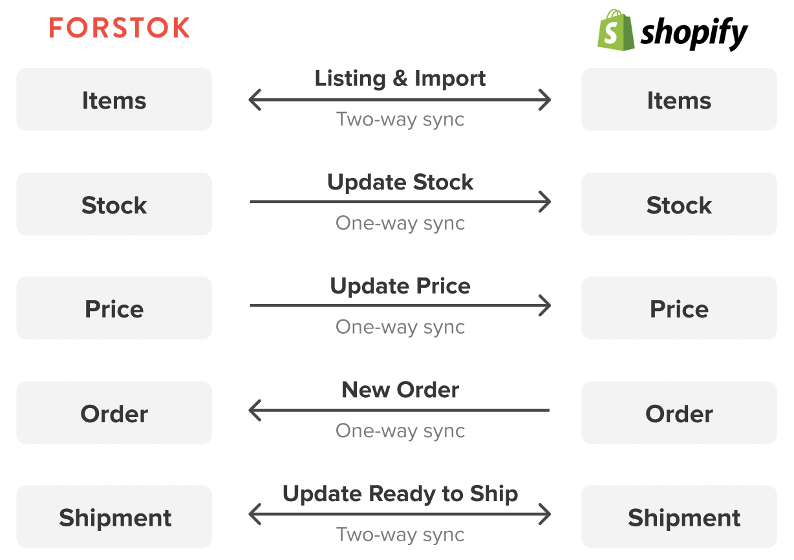

# Shopify (new integration)


Untuk integrasi Shopify ada 2 point:\
1\. Mendapatkan API Key, API Access Token di Seller Center Shopify\
2\. Integrasi Shopify ke Forstok


## Integrasi

Log In ke seller center Shopify atau akun Shopify

1. Klik **Apps** - **Develop Apps**
2. Klik **Create an app**
3. Input nama app, contoh 'Forstok', kemudian pilih user yang membuat app, pilih **Create App**
4. Pada halaman **App Development**, klik **Overview** - **Configure Admin API Scopes**
5. Centang semua akses pada **Admin API Configuration**
6. Klik **Save**
7. Pada tab **API Credentials** --> **Access Tokens**, klik **Install App**
8. Klik **Install**
9. **API Key** dan **Admin API access token** akan digunakan untuk integrasi Shopify di Forstok

## Integrasi Shopify di Forstok

1. Login ke Forstok
2. Klik Integration - Add Integrations&#x20;
3. Input API Key, API Access Token, dan domain web


**PERLU DIKETAHUI:**

1. **Saat ini masih terdapat limitasi, di mana integrasi shopify hanya bisa dilakukan ke 1 warehouse shopify, yaitu warehouse utama/ warehouse default, apabila warehouse shopify ada lebih dari 1, mohon komunikasikan ke tim Forstok;**
2. **Infokan ke tim Forstok location id dari wh shopify melalui email onboarding@forstok.com setelah berhasil melakukan integrasi channel Shopify, location id bisa didapatkan dengan mengirimkan url saat membuka Settings - Location - klik lokasi warehouse yang mau di connect in ke forstok. Contoh: https://toko123.myshopify.com/admin/settings/locations/10236804;**
3. **Forstok hanya akan mengimport produk dengan status aktif dan **_**in stock**_**/ stok tersedia, apabila stok masih 0, lakukan penyesuaian terlebih dahulu agar item bisa terimport ke Forstok.**

