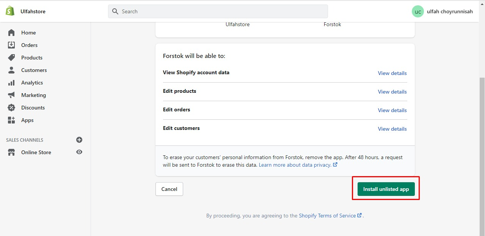
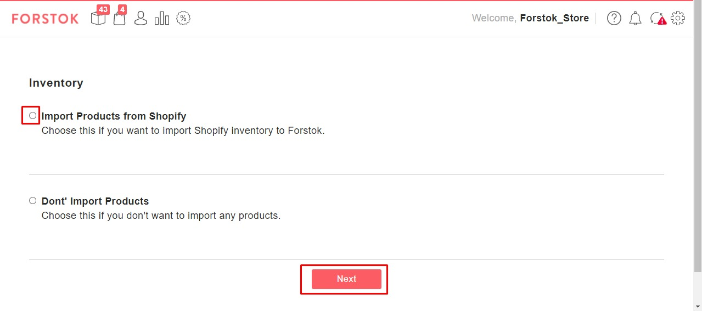
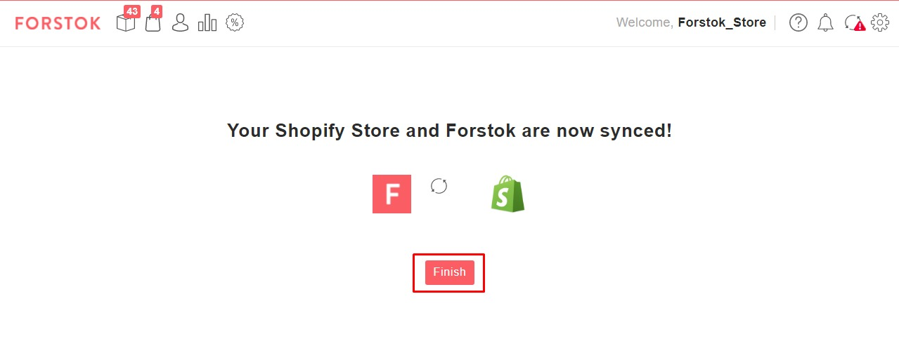
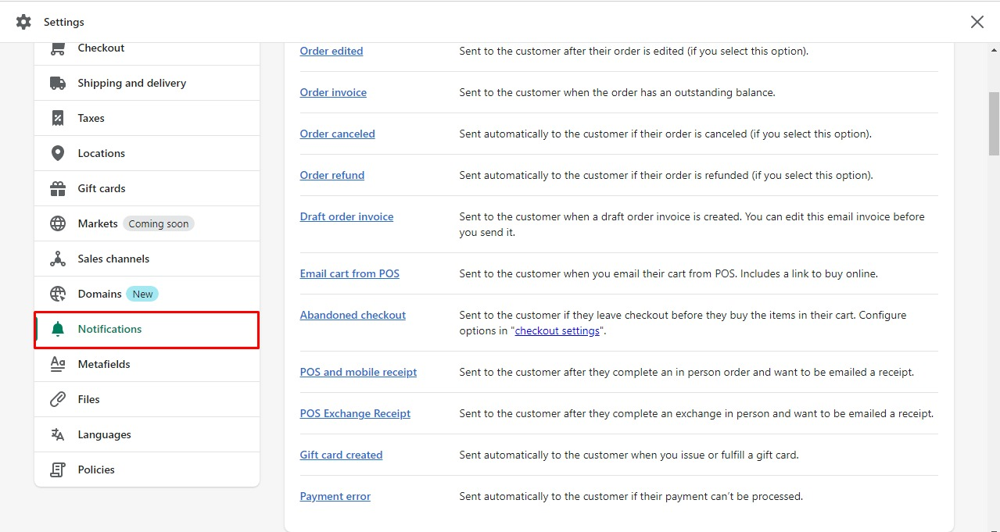
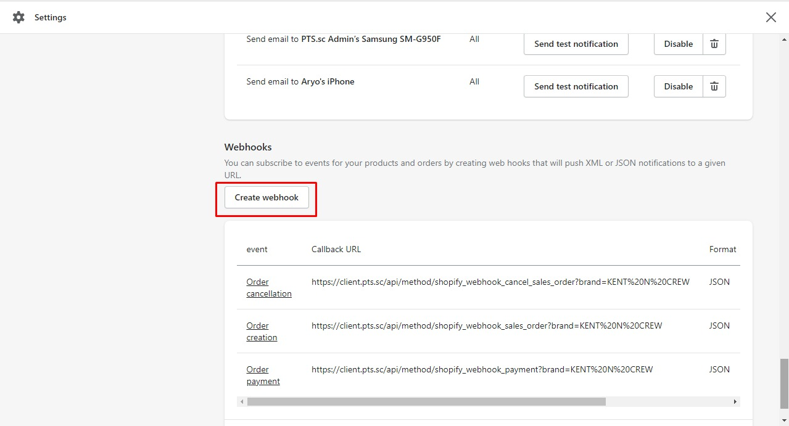

# Shopify


Untuk integrasi Shopify ada 2 point:\
1\. Integrasi Shopify ke Forstok\
2\. Mendaftarkan order webhook Shopify


## Integrasi

Pastikan Anda sudah Log In ke seller center Shopify atau akun Shopify

\
1.Buka Link berikut:\
[**https://www.forstok.com/dashboard/channels/integrations/shopify/setup**](https://www.forstok.com/dashboard/channels/integrations/shopify/setup)****\
****\
****2. Input URL Link myshopify

**Contoh URL Link:** [onycha.myshopify.com](http://onycha.myshopify.com)\

.png>)

3\. Scroll kebawah lalu klik **Install Unlisted App**\
****

 

4\. Pada Product Catalog pilih **Sync Product from Shopee** >**Next** \
****

 

5\. Lalu pilih **Finish**\
****

 

## Mendaftarkan webhook

Setelah berhasil integrasi, harap daftarkan Webhook order dari seller center Shopify. _Webhook_ atau yang biasa disebut _callback_ adalah cara bagi suatu aplikasi untuk menyediakan aplikasi lain dengan informasi _real-time_. Jika sudah mendaftarkan webhook ini, maka jika terjadi order baru atau order update dari Shopify system akan dikirim ke Forstok application secara real-time.

1\. Log ke Shopify,  pilih **Settings** pada menu di sebelah kiri → lalu klik **Notifications**

  

2\. Scroll kebawah lalu klik **create webhook**

 

3\. Pada Add a webhook input:\
**URL:** [**https://order.forstok.com/channels/shopify**\
****](https://orders.forstok.com/channels)**Webhook API version: pilih yang Latest**

Order/creation\
orders/fulfillment \
orders/payment \
orders/update \
order/cancellation

.png>)

.png>)

****
