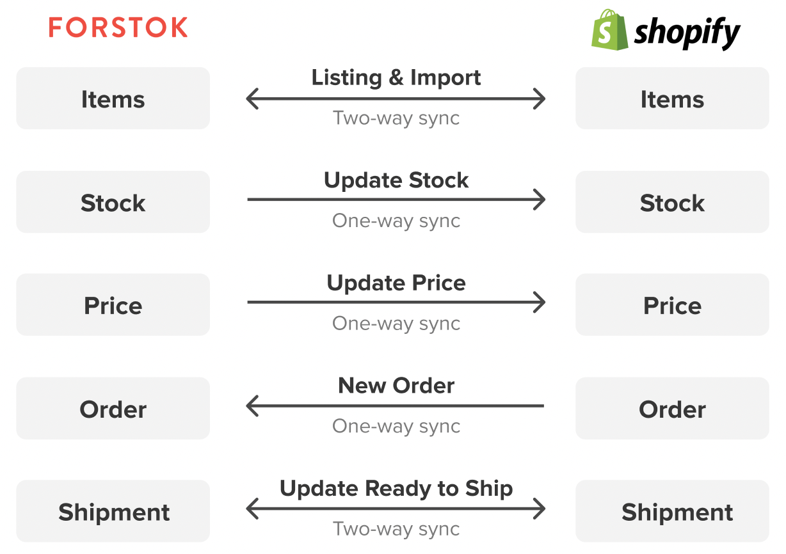

# Shopify


Untuk integrasi Shopify ada 2 point:  
1. Integrasi Shopify ke Forstok  
2. Mendaftarkan order webhook Shopify


## Integrasi

  
1.Buka Link berikut:  
[**https://www.forstok.com/dashboard/channels/integrations/shopify/setup**](https://www.forstok.com/dashboard/channels/integrations/shopify/setup)  
  
****2. Lalu isi kolom sesuai dengan alamat web shopify &gt; lalu klik **Install Shopify**

3. Scroll kebawah lalu klik **Install Unlisted App**  

4. Pada Product Catalog pilih **Sync Product from Shopee** &gt;**Next**   
****

5. Lalu pilih **Finish**  

## Mendaftarkan webhook

Setelah berhasil integrasi, harap daftarkan Webhook order dari seller center Shopify

1. Log ke Shopify,  pilih **Settings** pada menu di sebelah kiri → lalu klik **Notifications**

2. Scroll kebawah lalu klik **create webhook**

3. Pada Add a webhook input:  
**URL:** [**https://orders.forstok.com/channels**  
](https://orders.forstok.com/channels)**Webhook API version: 2020-04 \(Latest\)**

\*\*\*\*

