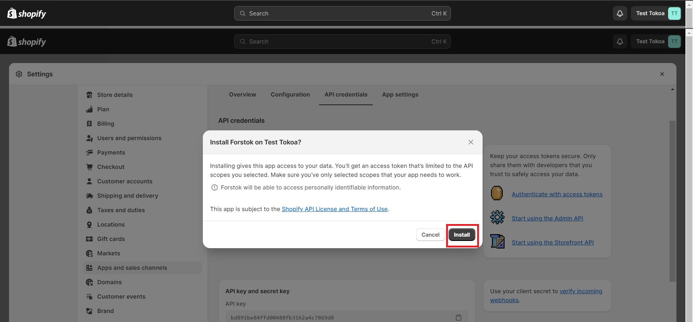

# Shopify (new integration)


Untuk integrasi Shopify ada 2 point:\
1\. Mendapatkan API Key, API Access Token di Seller Center Shopify\
2\. Integrasi Shopify ke Forstok


## Integrasi

Log In ke seller center Shopify atau akun Shopify

1. Klik **Settings**

<figure><figcaption></figcaption></figure>

2. Apps and sales channels --> Develop apps

<figure><figcaption></figcaption></figure>

3. Allow custom app development

<figure><figcaption></figcaption></figure>

4. Klik **Allow custom app development** kembali

<figure><figcaption></figcaption></figure>

5. Create an app

<figure><figcaption></figcaption></figure>

6. Isi **App name** --> **Create app**

<figure><figcaption></figcaption></figure>

7. Pada menu App development, klik **API Credentials** --> **Configure Admin API scopes**

<figure><figcaption></figcaption></figure>

8. Centang seluruh jenis akses

<figure><figcaption></figcaption></figure>

9. Klik **Save**

<figure><figcaption></figcaption></figure>

10. Klik tab **API** credentials -->**Install app**

<figure><figcaption></figcaption></figure>

11. Klik **Install**

<figure><figcaption></figcaption></figure>

12. Pada tab **API Credentials**, klik **Reveal token once**, copy API access token dan API key, simpan untuk digunakan pada proses integrasi Shopify di Forstok

<figure><figcaption></figcaption></figure>

## Integrasi Shopify di Forstok

1. Login ke Forstok
2. Klik Integration - Add Integrations&#x20;
3. Input **API Key**, **Admin API Access Token**, dan domain web


**PERLU DIKETAHUI:**

1. **Saat ini masih terdapat limitasi, di mana integrasi shopify hanya bisa dilakukan ke 1 warehouse shopify, yaitu warehouse utama/ warehouse default, apabila warehouse shopify ada lebih dari 1, mohon komunikasikan ke tim Forstok;**
2. **Infokan ke tim Forstok location id dari wh shopify melalui email onboarding@forstok.com setelah berhasil melakukan integrasi channel Shopify, location id bisa didapatkan dengan mengirimkan url saat membuka Settings - Location - klik lokasi warehouse yang mau di connect in ke forstok. Contoh: https://toko123.myshopify.com/admin/settings/locations/10236804;**
3. **Forstok hanya akan mengimport produk dengan status aktif dan **_**in stock**_**/ stok tersedia, apabila stok masih 0, lakukan penyesuaian terlebih dahulu agar item bisa terimport ke Forstok.**

