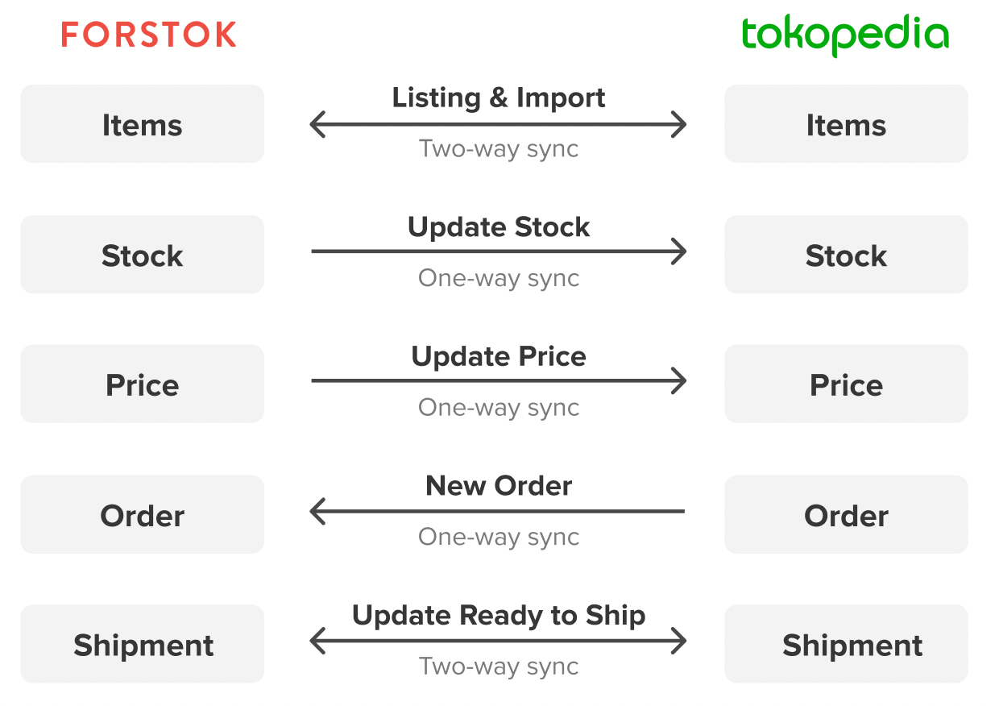

# Tokopedia


**Penting!**  Sebelum integrasi, pastikan product di Seller Center Tokopedia sudah diisikan SKU sampai level variant (setiap variant memiliki SKU yang berbeda) dan sudah disamakan juga di toko/channel lainnya. Setelah integration, product akan di import dan terlinking dengan product yang sama mengunakan Kode SKU.



**Limitasi import item API Tokopedia**

* Forstok akan tetap mengimport item di tokopedia yang status tidak aktif tapi ada stok, dan item tersebut akan berubah menjadi aktif, apabila item tidak ingin diimport, bisa diarsipkan terlebih dahulu.
* Sebelum import item ke Forstok, pastikan status produk sudah **aktif dan ada stok**


## Cara Integrasi Tokopedia (Step-by-step)

1. Sebelum integrasi ke Tokopedia pastikan Anda sudah memenuhi syarat Integrasi berikut:

* [x] Toko sudah **Official Store** atau **Power Merchant**
* [x] Pastikan Toko Anda tidak connect atau terintegrasi dengan sistem lain, lampirkan screenshot/tangkapan layar dari Pengaturan Aplikasi Pihak Ketiga pada tiket yang dibuat untuk konfirmasi bahwa toko anda tidak connect/terintegrasi dengan sistem lain.
* [x] Buat tiket untuk request integrasi Tokopedia pada: [http://support.forstok.com/support/tickets/new](http://support.forstok.com/support/tickets/new)


**Subject: Request API Tokopedia - \[Nama Toko]**&#x20;

**Description:**&#x20;

Hi Tim Forstok,

Mohon bantuannya untuk infokan API Tokopedia untuk kami integrasikan ke Forstok.\
\
Tokopedia Store link: [https://www.tokopedia.com/abc](https://www.tokopedia.com/abc)

Berikut adalah screenshot tampilan Pengaturan Aplikasi Pihak Ketiga:

.png>)\
\
Demikian kami sampaikan, atas perhatiannya kami ucapkan terima kasih


Forstok akan kirimkan request approval API Tokopedia.&#x20;

Buka seller center Tokopedia > Aplikasi Pihak Ketiga > Menunggu Pesetujuan > Klik terima

 (1) (1) (1).png>)

Jika sudah klik terima, email kembali ke tim Forstok dengan melampirkan tangkapan layar tampilan Pengaturan Aplikasi Pihak Ketiga seperti tampilan berikut:

Selanjutnya tim Forstok akan mengirimkan email credentials yang dibutuhkan untuk proses integrasi.

**Integrations**

1\. Pilih menu Integrations > pilih Add Integrations

.png>)

2\. Klik '**Connect**' untuk integrasikan Tokopedia

[\
](https://s3.amazonaws.com/cdn.freshdesk.com/data/helpdesk/attachments/production/48062572994/original/VAz3XK3s1NDWKHiptEuteE-zA0yqniyYyw.png?1601813140)3. Input FS ID, Shop ID, Client ID, Client Secret yang bisa didapatkan dari tim Forstok melalui email.

4\. Pada Product Catalog pilih Sync Product from Tokopedia -->Next --> pilih Finish.\
5\. Untuk melihat hasil integrasi, klik **Integrations**, apabila berhasil, channel Tokopedia akan muncul. Klik '**item sync is off**' untuk mulai proses import items.


Lihat [https://docs.forstok.com/knowledge-base/before-integrations/onboarding-steps/migrate-to-forstok](https://docs.forstok.com/knowledge-base/before-integrations/onboarding-steps/migrate-to-forstok) untuk mengaktifkan sync stok agar stok di forstok bisa sinkron dengan stok di channel/marketplace.

