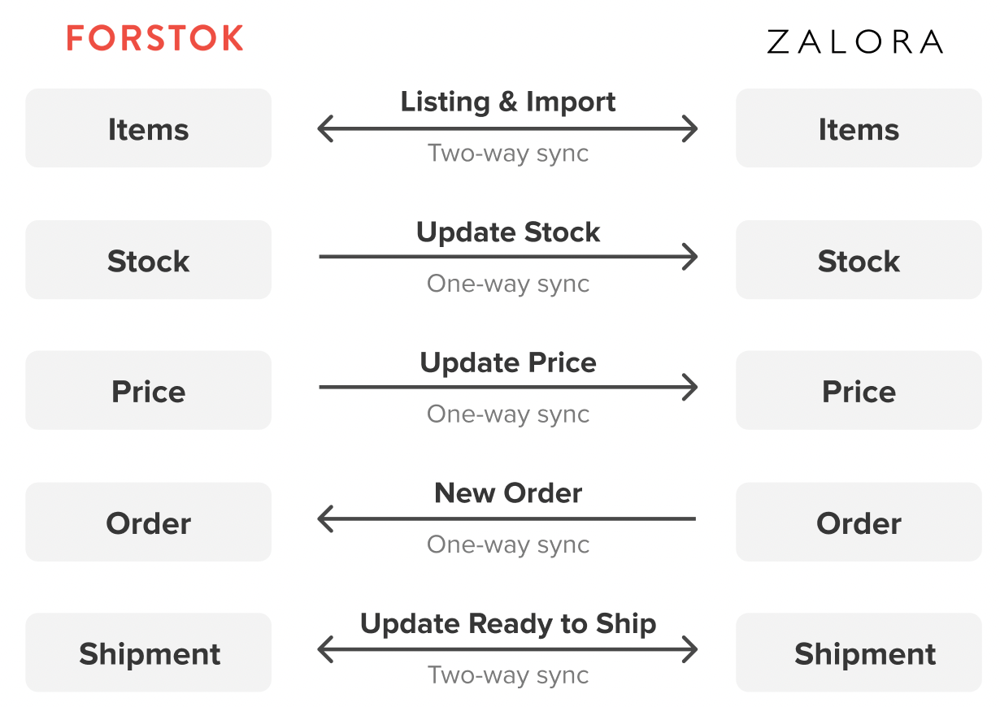

# Zalora


**Penting!**  Sebelum integrasi, pasti kan product yang sama di toko/ channel lain mempunyai Kode SKU yang sama. Setelah integration, product akan di import dan terlinking dengan product yang sama mengunakan Kode SKU.


## Cara Integrasi Zalora \(Step-by-step\)

1. Untuk Integrasi ke Zalora terlebih dahulu log in ke seller center Zalora di [https://sellercenter.zalora.co.id/](https://sellercenter.zalora.co.id/) untuk mendapatkan API Zalora.  
Pilih Settings &gt; Integration Management

2. Pada kolom API dan API Key copy paste API Zalora pada integrasi Zalora Forstok.

3. Pilih menu Integrations --&gt; pilih Add Integrations

4. Klik View/Connect untuk integrasikan Zalora

5. Input Email log Zalora dan API Key Zalora yang sudah kita dapatkan pada point 2. Lalu klik Install Zalora

6. Pada Product Catalog pilih **Sync Product from Zalora --**&gt;**Next --**&gt; pilih **Finish**

7. Maka Zalora berhasil integrasi ke Forstok dan sedang proses import produk. 

