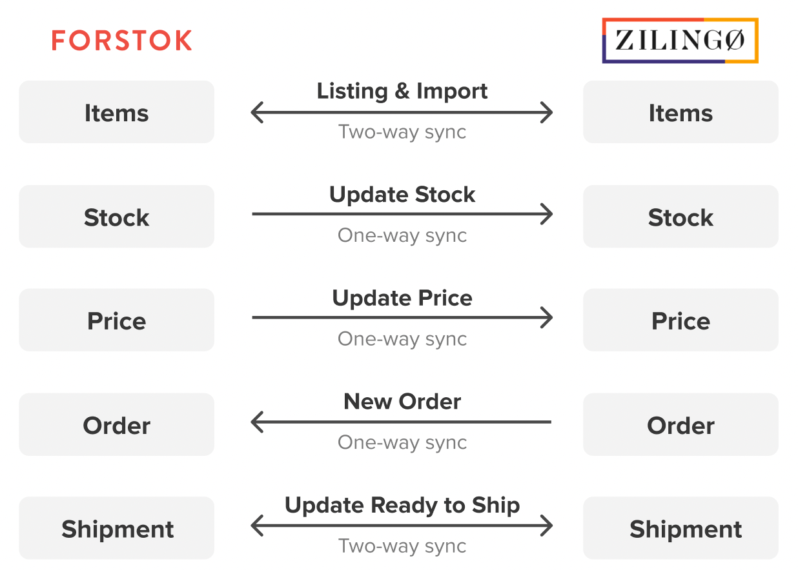

# Zilingo


**Penting!**  Sebelum integrasi, pasti kan product yang sama di toko/ channel lain mempunyai Kode SKU yang sama. Setelah integration, product akan di import dan terlinking dengan product yang sama mengunakan Kode SKU.


## Cara Integrasi Zilingo \(Step-by-step\)

1. Email ke Forstok untuk dapatkan  API key untuk integrasi Zilingo harap menghubungi tim Onboarding Forstok, karena credential API yang bersifat rahasia dimana kami perlu request ke tim marketplace terkait. Mohon email ke [onboarding@forstok.com](mailto:onboarding@forstok.com)

Subject: Store Name - Zilingo Integrations

Hi Forstok Team,  
Please help Zillingo integrations to Forstok. Here find below our Zilingo store ID.  
  
Store ID: ABC  
Screenshot seller center:  
_**Don't forget to click on the top right profile.**_

2. Setelah menerima Email balasan dari Forstok, kembali ke Forstok. Pilih menu Integrations &gt; pilih Add Integrations

3.  Klik View/Connect untuk integrasikan Zilingo

4. Input Seller ID dan API Key yang sudah di infokan tin Forstok by Email.

5. Pada Product Catalog pilih **Sync Product from Zilingo** &gt; Next &gt; pilih Finish

6. Zilingo berhasil integrasi ke Forstok dan sedang proses import produk.

