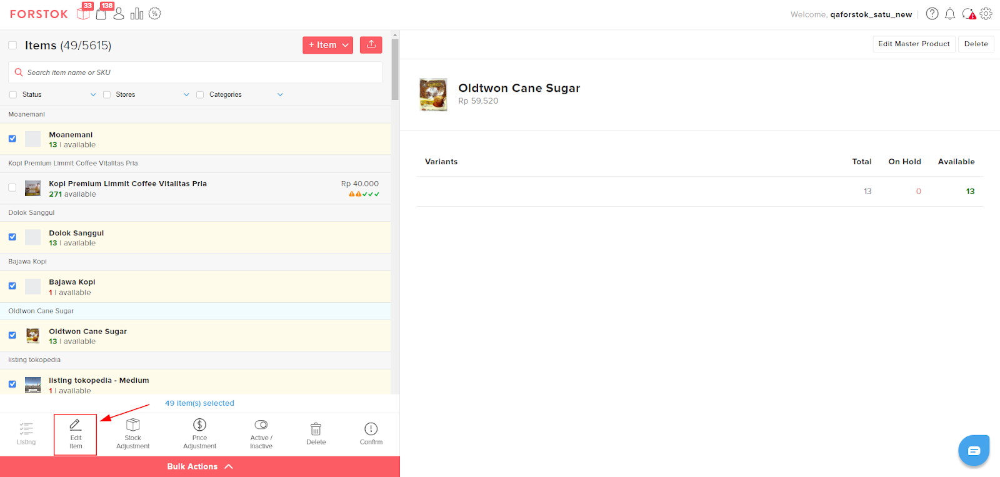
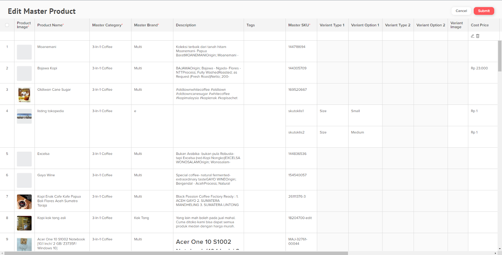

# Edit Master Product (NEW)

### Single Edit Master Product

1. Ada 2 cara untuk Edit Master Product, pertama pada menu items klik Edit Master Product.

<figure><figcaption></figcaption></figure>

Kedua, pilih varian items yang ingin diubah kemudian pilih Menu Edit, klik Edit Master Product. Kedua cara ini akan membuka tab baru pada browser.

<figure><figcaption></figcaption></figure>

2. Silahkan Edit artikel produk yang ingin diperbaiki. Scroll ke kanan untuk lihat lebih lengkap field artikel. Jika sudah selesai pilih submit.

<figure><figcaption></figcaption></figure>

### Bulk Edit Master Product (NEW)

1. Pilih beberapa items/variant items yang ingin diubah kemudian pilih Menu Edit Item di Bulk Actions.

<figure><figcaption></figcaption></figure>

2. Silahkan Edit artikel produk-produk yang ingin diperbaiki. Scroll ke kanan untuk lihat lebih lengkap field artikel. Jika sudah selesai pilih submit.

<figure><figcaption></figcaption></figure>
