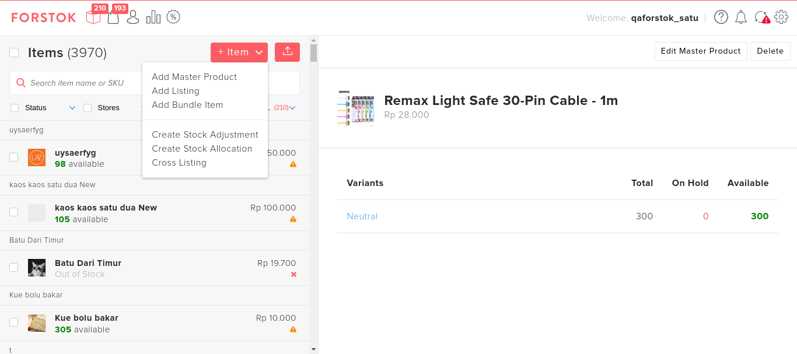
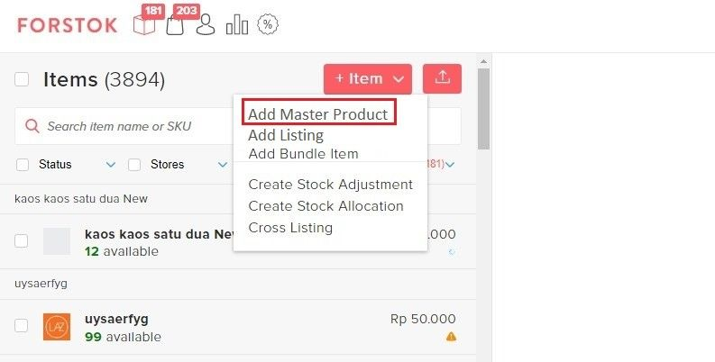
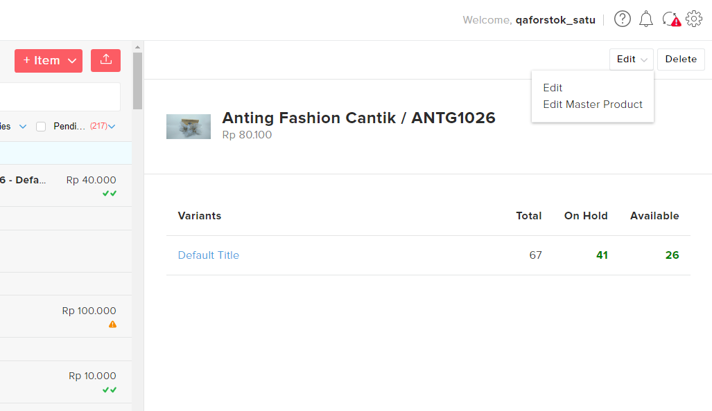

# Master Product v.2 Overview (NEW)

## What’s New

1. **Add Master Product :** Menambahkan Master Product di Forstok yang dapat berdiri sendiri.
2. **Edit Master Product :** Melakukan perubahan di Master Product, tidak ada edit listing.

## **1. + Item**

* Add Master Product: Menambahkan Master Product yg bisa stand-alone (berdiri sendiri)  tanpa harus terlisting ke channel (marketplace).
* Add Bundle Product : Untuk menghubungkan stock item bundling dengan item satuan atau main item.
* Add Listing : Untuk listing item baru ke channel (marketplace).

<figure><figcaption></figcaption></figure>

<figure><figcaption></figcaption></figure>

## **2.** Edit Master Product

* Edit Master Product : Untuk mengedit atau memperbaiki seperti deskripsi produk, gambar produk, atau field lainnya di Master Product

<figure><figcaption></figcaption></figure>

### **Add Master Product (NEW)**

* **Add Listing:** Fungsinya adalah untuk listing item baru ke channel (marketplace).

1. Pada menu item pilih +Item -> Add Master Products. Akan membuka Tab baru pada browser.

2\. Klik tombol Add Product, maka akan muncul Field Add Master Product.

<figure><figcaption></figcaption></figure>

3\. Lengkapi nama produk pada ‘_Product Name_’. Pilih Category pada field ‘_Master Category_’ dan ‘_Master Brand'_. Lalu lengkapi deskripsi produk pada field ‘_Description_’. Lengkapi berat, panjang, lebar dan tinggi product pada field ‘_Weight’_, ‘_Length_’, ‘_Width_’, dan ‘_Height_’.

<figure><figcaption></figcaption></figure>

4\. Jika produk Anda mempunyai varian, mohon klik checkbox berikut dan isi _Variant Type_ dan _Option_ sesuai produk varian Anda. Kemudian isi field _Master SKU_, _Qty on Hand_, _Regular Price_, _Cost Price_, Sale Price, dan _Barcode._


Note : Jika produk Anda tidak mempunyai variant tidak perlu centang checkbox tersebut. Field bertanda ( <mark style="color:red;">\*</mark> ) wajib diisi (mandatory field).


<figure><figcaption></figcaption></figure>

5\. Lengkapi gambar produk pada field ‘Product Image’ dan lengkapi gambar varian produk pada field ‘Variant Image’. Lengkapi field ‘Tags’ jika ingin menambahkan tag tentang produk. Kemudian klik save.


Note: Gambar produk wajib diisi sesuai dengan produk. Variant image bersifat opsional.


<figure><figcaption></figcaption></figure>

6\. Scroll ke samping jika masih ingin merubah field Master Product. Apabila ingin menambahkan produk, klik ‘Add Product’ kemudian ikuti langkah sebelumnya. Jika sudah tidak ada lagi yang ingin ditambahkan silahkan klik submit.

<figure><figcaption></figcaption></figure>

7\. Master Product berhasil ditambahkan.

 (1) (1).png>)

### **Edit Master Product (NEW)**

Berikut langkah-langkah menambahkan Master Product yang belum ada di Forstok:

1. Ada 2 cara untuk Edit Master Product.

**Cara pertama** pada menu items klik Edit Master Product. **** Berikut ini untuk lampiran cara yang pertama.

**Cara kedua** pilih varian items yang ingin diubah kemudian pilih Menu Edit - klik Edit Master Product. Kedua cara ini akan membuka Tab baru pada browser Anda.

<figure><figcaption></figcaption></figure>

2\. Silahkan Edit artikel produk yang ingin diperbaiki. Scroll ke kanan untuk lihat lebih lengkap field artikel. Jika sudah selesai pilih submit.

<figure><figcaption></figcaption></figure>
