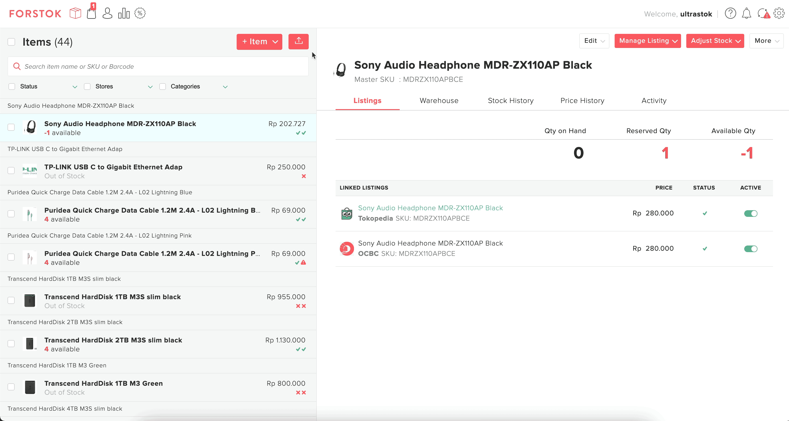

# Upload Stock Adjustment Final Qty \(xls\)

### Video

1. Pada menu Item Forstok pilih tanda panah berikut dan Upload Stock Adjustment

2. Pilih dan FInal Qty \(xls\), file bisa di download pada Notifications

3. Input stock yang akan di update pada kolom New Qty On Hand 

Misal yang ada di gudang saat ini ada 10, maka di Forstok juga input 10.

4. Upload dan import file tsb

5.  Untuk melihat hasil update qty tsb klik icon Notifications - More Activity. Download pada **Summary File**

