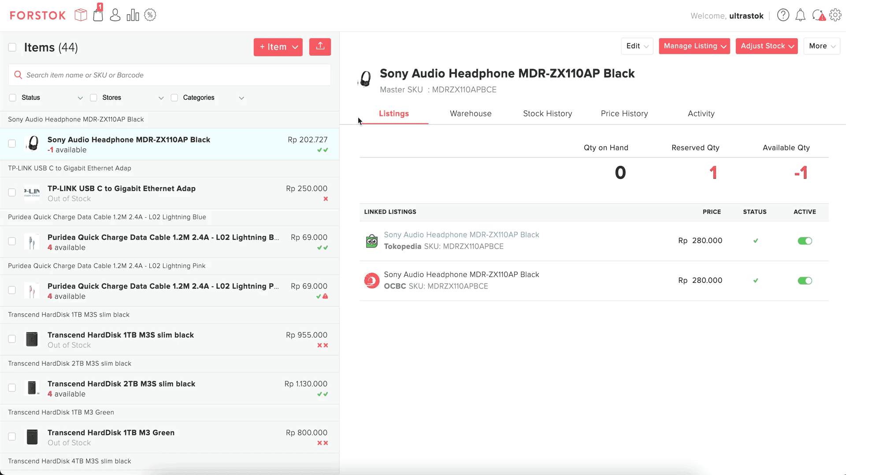
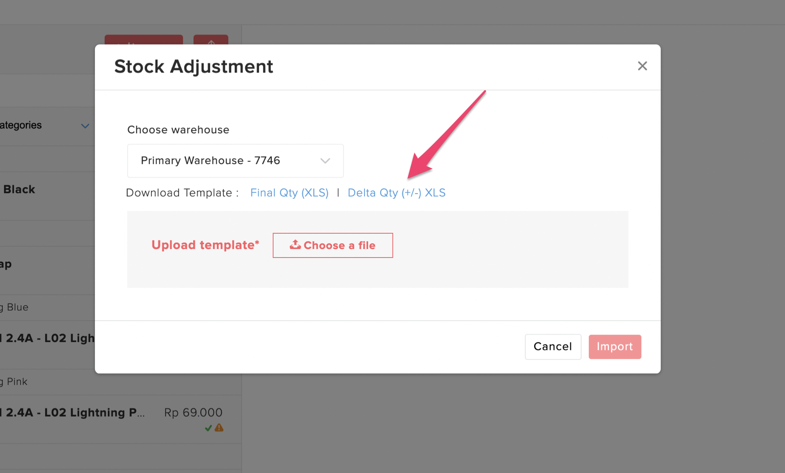

# Upload Stock Adjustment Delta Qty +/- \(xls\)

### Video

1. Pada menu Item Forstok pilih tanda panah berikut dan Upload Stock Adjustment

2. Pilih dan download Delta Qty \(+/-\) XLS , file bisa di download pada Notifications

3. Input stock yang akan di update.

* Jika penambahan stock \(+\) cukup input tanpa tanda +
* Jika pengurangan stock \(-\) input dengan menambahan tanda -

4. Upload dan import file tsb

5.  Untuk melihat hasil update qty tsb klik icon Notifications - More Activity. Download pada **Summary File**

6. Berikut tampilan hasil update stock delta \(+/-\)

Contoh sku:  
WRL500 stock sebelumnya 30 + 5 = 35  
CRM1000 stock sebelumnya 30 - 5 = 25

