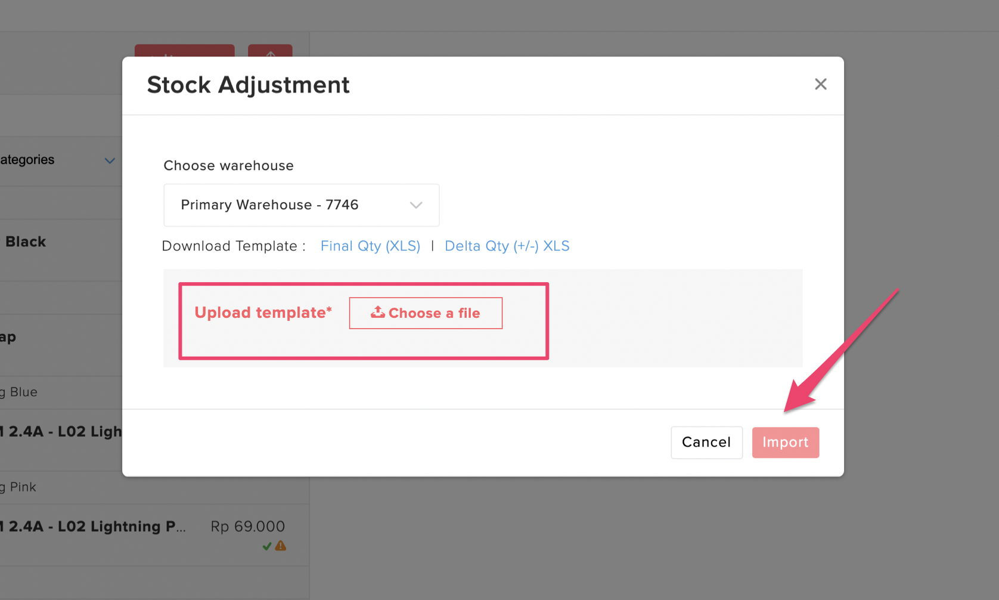

# Upload Stock Adjustment Delta Qty \(csv\)

### Video

1. Pada menu Item Forstok pilih tanda panah berikut dan klik Bulk Update Quantity \(Beta\)

2. Download template Update Quanity Delta Qty \(csv\). File excelnya masuk ke email. Lalu download file excel Bulk Update Qty tsb bisa di download pada menu notifications sebelah kanan atas.

3. Berikut tampilan excel Bulk Update Qty. Stock yang akan di update di isi pada kolom New Qty on Hand \(kolom E\). Stock yang di isi real stock yang ada. Contoh jika ingin update stock jadi 6 di kolom Total Qty harus di isi 6 juga.   
  
Jangan lupa unprotect file. Password: forstok123

4. Setelah excel Bulk Update Qty di isi. Lalu upload file tsb pada menu Bulk Update Qty tadi. Lalu import.

5. Untuk melihat hasil update qty tsb klik icon Notifications. Hasilnya bisa dilihat dari activity tsb.

