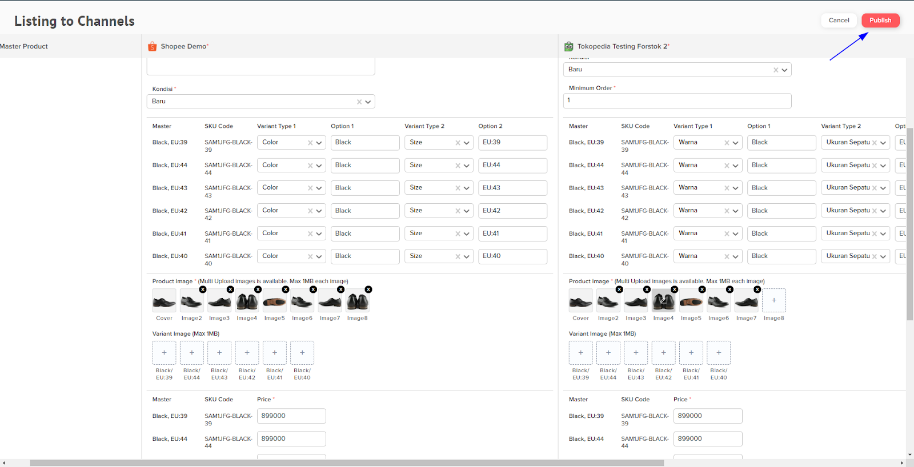
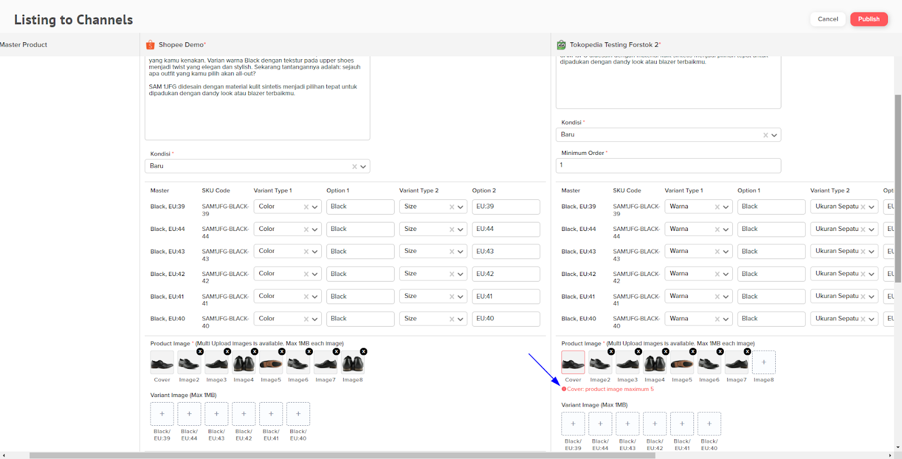
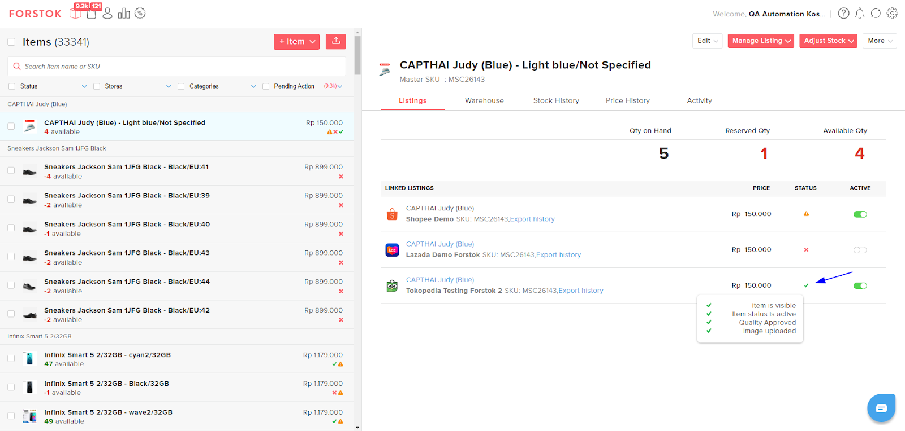

# Add Listing v2 (NEW)

### Add listing v2&#x20;

1. Pertama single item, pada menu items pilih item yang ingin di listingkan. Pilih Manage Listing, kemudian klik Add Listing V2.

<figure><figcaption></figcaption></figure>

2. Kemudian pilih 1 atau lebih store yang akan di listingkan dan pilih Continue.

<figure><figcaption></figcaption></figure>

3. Tab baru akan terbuka pada browser anda. Pilih Category untuk masing-masing store dan Marketplace.

<figure><figcaption></figcaption></figure>

4. Isi field yang di highlight merah atau field required. Geser layar ke kanan untuk melengkapi detail item pada store lainnya.


**Note :** Field yang tidak ada highlight merah sudah otomatis terisi sesuai dengan Master Product item yang dipilih tetapi anda tetap bisa mengubahnya.


<figure><figcaption></figcaption></figure>

5. Apabila sudah sesuai untuk seluruh field, klik Publish maka proses save dan upload/listing ke marketplace akan berjalan.

<figure><figcaption></figcaption></figure>


**Jika terdapat field yang belum sesuai maka akan muncul peringatan.**


<figure><figcaption></figcaption></figure>

Jika sudah sesuai, maka akan diarahkan halaman items. Klik item yang sudah di listingkan sebelumnya untuk melihat status listing.

<figure><figcaption></figcaption></figure>

### Bulk Listing

1. Pada tampilan kedua Pilihan Bulk yang tertera, pilih menu items lalu pilih lebih dari 1 item yang ingin di listingkan. Kemudian pilih Listing.

<figure><figcaption></figcaption></figure>

2. Pilih 1 atau lebih store yang akan di listingkan, kemudian pilih Continue.

<figure><figcaption></figcaption></figure>

3. Tab baru akan terbuka pada browser anda. Pilih Category untuk masing-masing store dan Marketplace. Jika item anda sudah listing sebelumnya, maka akan muncul peringatan kalau item tersebut sudah terlisting di store.

<figure><figcaption></figcaption></figure>

4. Isi field yang di highlight merah atau field required. Geser layar ke kanan dan ke bawah untuk melengkapi detail item dan store lainnya.


**Note :** Field yang tidak ada highlight merah sudah otomatis terisi sesuai dengan Master Product item yang dipilih tetapi anda tetap bisa mengubahnya.


<figure><figcaption></figcaption></figure>

5. Apabila sudah sesuai untuk seluruh field, klik Publish maka proses save dan upload/listing ke marketplace akan berjalan.

<figure><figcaption></figcaption></figure>

6. Jika terdapat field yang belum sesuai maka akan muncul peringatan.

<figure><figcaption></figcaption></figure>

Jika sudah sesuai, maka akan diarahkan halaman items. Klik item yang sudah di listingkan sebelumnya untuk melihat status listing.

<figure><figcaption></figcaption></figure>
