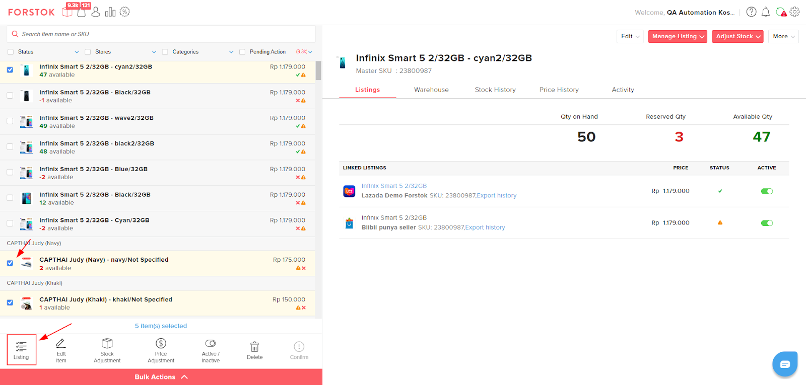

# Bulk Listing

1. Kedua Bulk tersebut , pada menu items pilih lebih dari 1 item yang ingin di listingkan. Kemudian pilih Listing

<figure><figcaption></figcaption></figure>

2. Pilih 1 atau lebih store yang akan di listingkan dan pilih Continue.

<figure><figcaption></figcaption></figure>

3. Tab baru akan terbuka pada browser anda. Pilih Category untuk masing-masing store dan Marketplace. Jika item anda sudah listing, akan muncul peringatan kalau item tersebut sudah terlisting di store.

<figure><figcaption></figcaption></figure>
