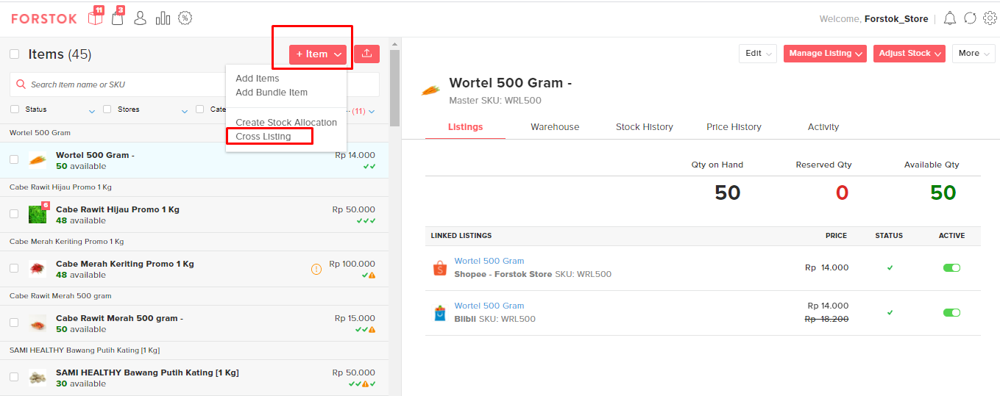
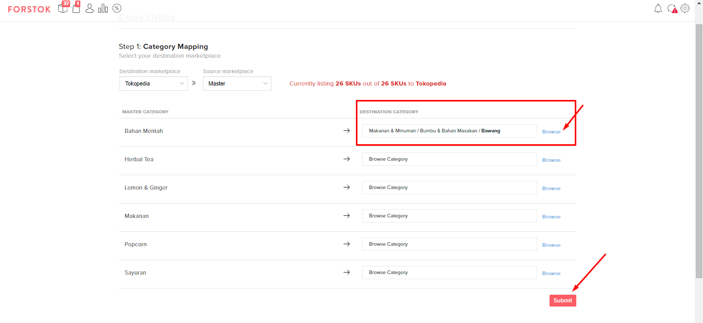
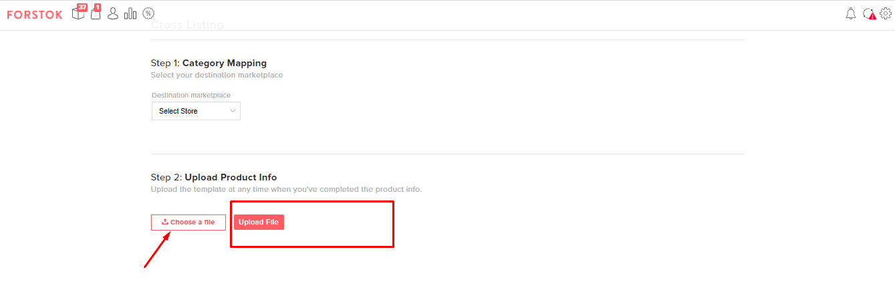

# Cross Listing from Master Product (XLS)

Cross listing from excel can be used if you want to add bulk / mass products from many categories to one channel. But, if you want to add only one product to many channel, you may use [Cross Listing](cross-listing-items-interface.md) from Forstok's dashboard.&#x20;


There are 2 steps to create Master Product, If the master product hasn't uploaded yet at Forstok.&#x20;

1. [Import Product from one of channel (Marketplace or website)](import-product-from-channels.md)
2. [Add master product](add-master-product.md)


These are the steps if you want to make cross listing:

1. Click item button, then click +Item after that choose **cross listing**.

2\. Choose the channel destination to listing and the category that will be listed.

3\. Started to mapping the category, then click **submit** for receiving the excel template.

4\. Click activity for downloading cross listing file and click to download the summary.

 (1).png>)

5\. After finished, please complete the data on csv template. For brand column you may download from the brand list. And for the brand list, please copy and paste code and the brand name.

 (1).png>)

6\. After finished, please save the file.

7\. Go on to the cross listing page, choose sales channel and its category, then choose csv file and upload.

8\. After uploaded the files and success, if you want to see the original files and the summary, you may access from activity log.&#x20;


If you want to listing to JD.ID and Woocommerce, you can not use by Forstok at the moment. Because there are some API limitations from marketplace that might do it directly from the seller center before you import to Forstok.



* Before using a cross listing, make sure there is a master item first in the Forstok and **the Master Item data has been filled**.&#x20;
* For the **Zalora** Seller Center, it is recommended to use Add Single Item or edit items and then add Zalora channels, because if you use a cross listing, the uploaded image will follow the previous channel or the image in the master item and is likely to be rejected by Zalora.&#x20;
* **For cross listing by using POS (Point of Sales)** if the SKU is in the form of numbers as a whole, then there will be an additional @ in front of the SKU so that the SKU can be read by the system. For example SKU 11245476 on SKU Master and Code in the form of @11245476, the SKU should not be replaced before the SKU is uploaded.&#x20;
* **For filling the column must be in accordance with the format in the download template**, it should not change the conditions in the template, for example in the condition template is a list of dropdown then copy paste text to change the drop down list into an ordinary text.
* For **filling the brands column**, you can download the brand file after downloading the cross listing template then search for the name of the brand, copy the ID and the name of the brand then paste it in the brand column on the cross listing page.

