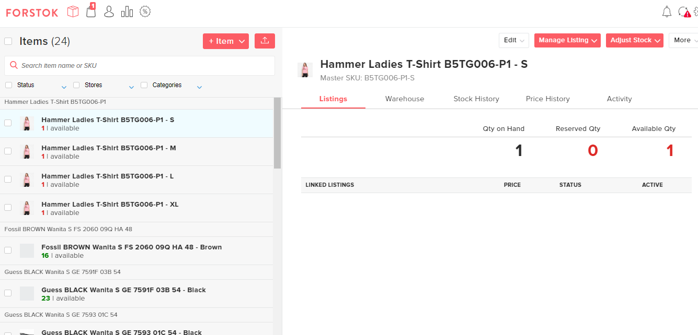
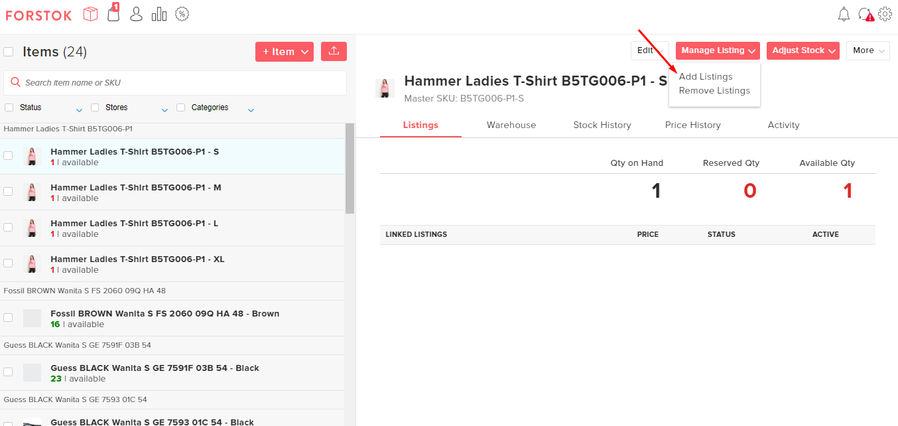
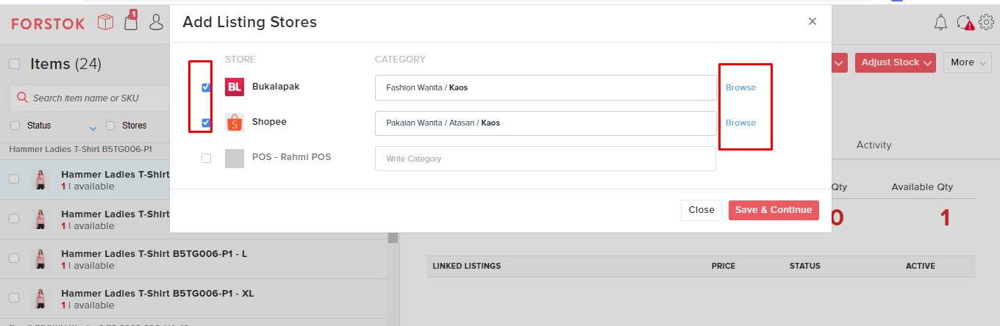
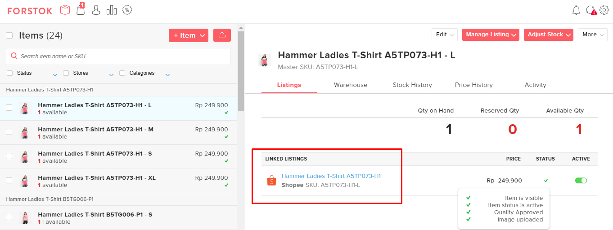

# Cross Listing from Master product (Add Listings)


There are 2 ways how to create Master product, If Master product hasn't been uploaded on Forstok dashboard.

1. [Import Product from one of the channels](import-product-from-channels.md) (Marketplace or website)
2. [Add Master Product](add-master-product.md)&#x20;


Add listing has a function to listing single item or variant item in order to show up in marketplace. There are some steps how to listing item by using add listing feature. Here's the video: [https://www.loom.com/share/5d4fe85b8a5947a9834d817c9fe735f9](https://www.loom.com/share/5d4fe85b8a5947a9834d817c9fe735f9)\
\
1\. Make sure you already turn on the export item. No exclamation mark.


Why you need to activate sync export (ON) before listing?

\--> So that the items listed, stock update, edit, price updates that are made from Forstok can be updated or mirroring to the marketplace.


 (1).png>)

2\. Master Item has been uploaded or items that will be purchased already on the Forstok Imported Channel Item Results.

3\. Continued for listing items. Select Manage Listing - Add Listings

4\. Choose the Marketplace that will be purchased and mapping the category for the marketplace. Then save & continue.

5\. Then continue to fill mandatory fields for the selected marketplace. If it's done, save.

6\. Then the item that has been listed was already live in the marketplace. You may check the item that has been listed on the marketplace by clicking the live link on the Forstok's dashboard.


For listing to JD.ID V2, WooCommerce, Magento, and Tiktok can not be listed from Forstok because there are API Limitation Listing from the Marketplace so it must be done directly from the Seller Center and then import it to Forstok.

