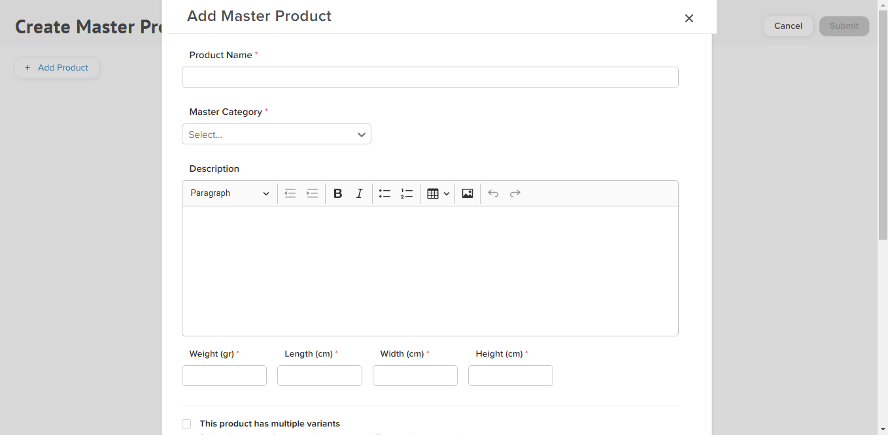
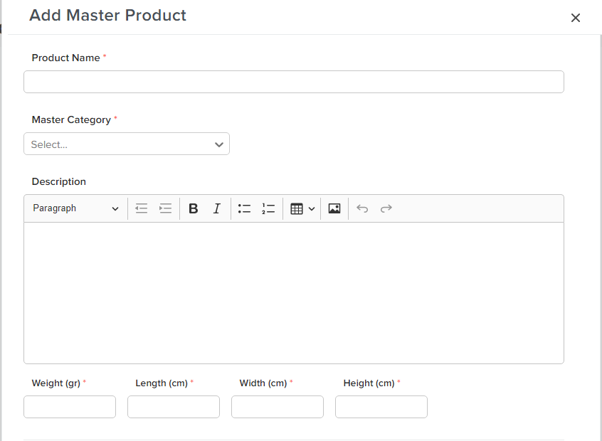
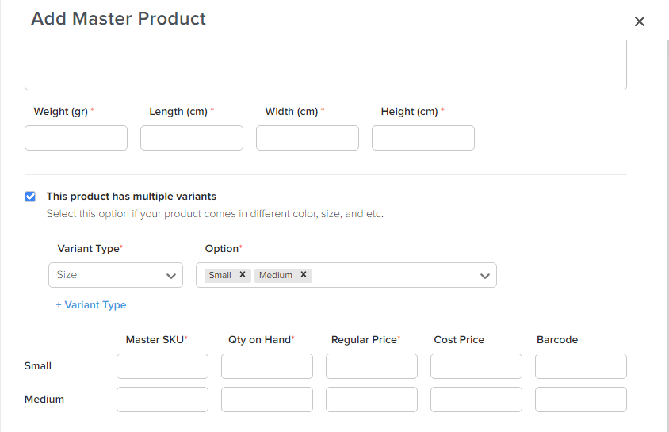
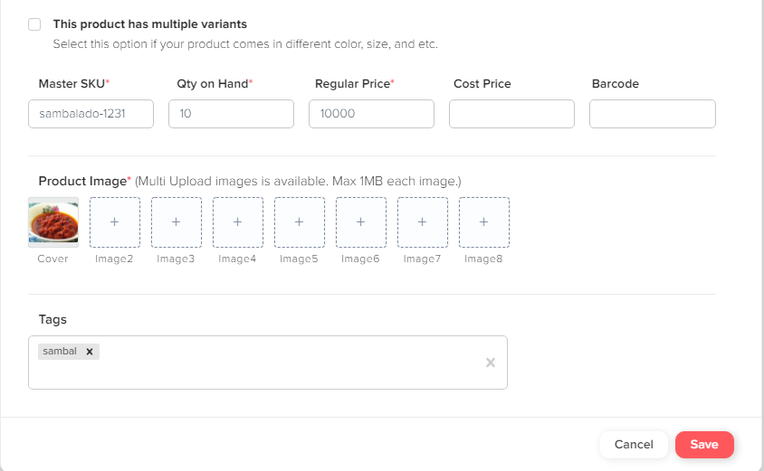
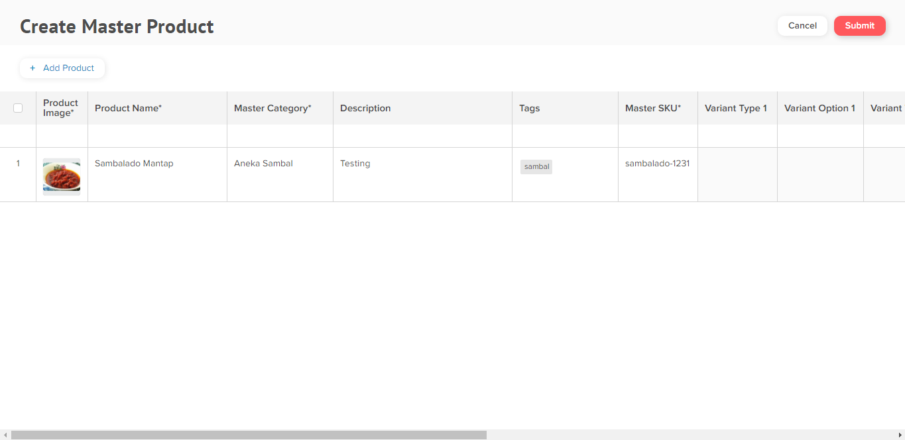
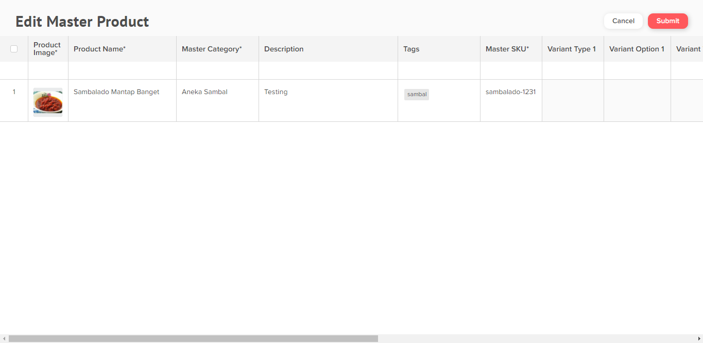

# Master Product (NEW)

### **Add Master Product (NEW)**

1. Pada menu item pilih +Item -> Add Master Products. Akan membuka Tab baru pada browser.

2\. Klik tombol Add Product, maka akan muncul Field Add Master Product.

3\. Lengkapi nama produk pada ‘Product Name’. Kemudian pilih category pada field ‘Master Category’. Lalu lengkapi deskripsi product pada field ‘Description’. Lengkapi berat, panjang, lebar dan tinggi product pada field ‘Weight’, ‘Length’, ‘Width’, dan ‘Height’.

4\. Apabila produk Anda mempunyai variant, mohon klik _checkbox_ berikut dan lengkapi Variant Type dan Option sesuai produk variant Anda. Kemudian isi field Master SKU, Qty on Hand, Regular Price, Cost Price, dan Barcode.


Note : Jika produk Anda tidak mempunyai variant tidak perlu centang checkbox tersebut. Field bertanda ( <mark style="color:red;">\*</mark> ) wajib diisi (mandatory field).


5\. Lengkapi gambar produk pada field ‘Product Image’ dan lengkapi gambar varian produk pada field ‘Variant Image’. Lengkapi field ‘Tags’ jika ingin menambahkan tag tentang produk. Kemudian klik save.


Note: Gambar produk wajib diisi sesuai dengan produk. Variant image bersifat opsional.


6\. Scroll ke samping jika masih ingin merubah field Master Product. Apabila ingin menambahkan produk, klik ‘Add Product’ kemudian ikuti langkah sebelumnya. Jika sudah tidak ada lagi yang ingin ditambahkan silahkan klik submit.

7\. Master Product berhasil ditambahkan.

 (1).png>)

### **Edit Master Product (NEW)**

1. Pada menu items klik Edit Master Product. Akan membuka Tab baru browser.

2\. Silahkan Edit artikel produk yang ingin diperbaiki. Scroll ke kanan untuk lihat lebih lengkap field artikel. Jika sudah selesai pilih submit.

