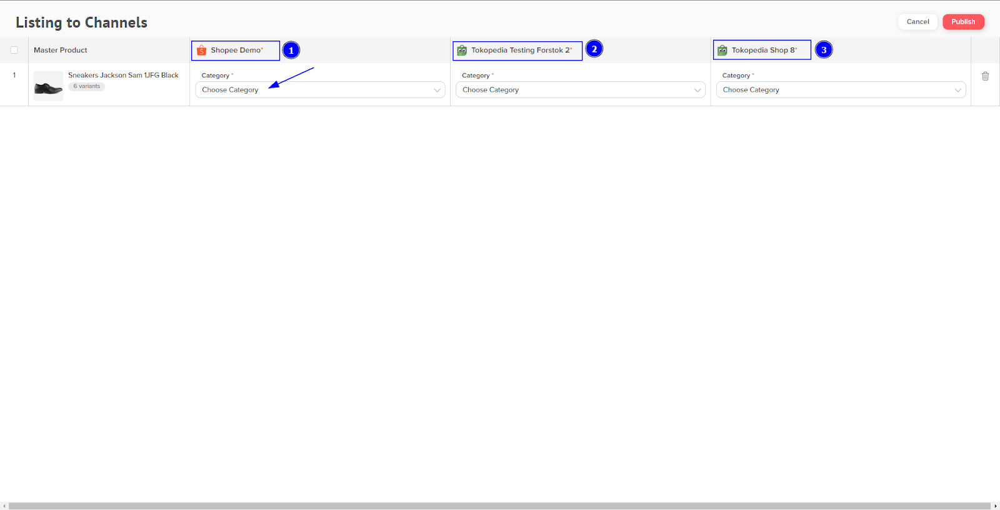
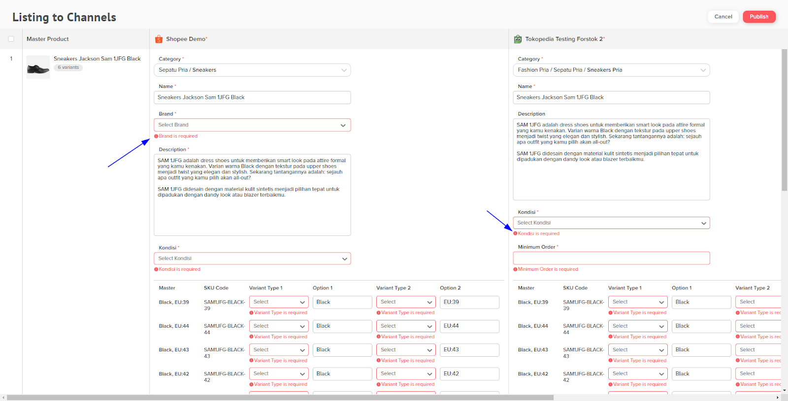
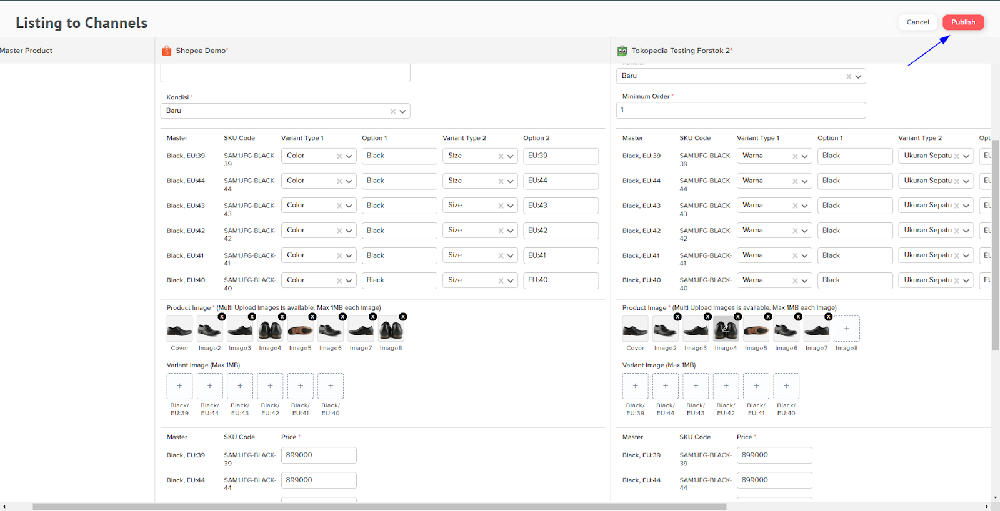
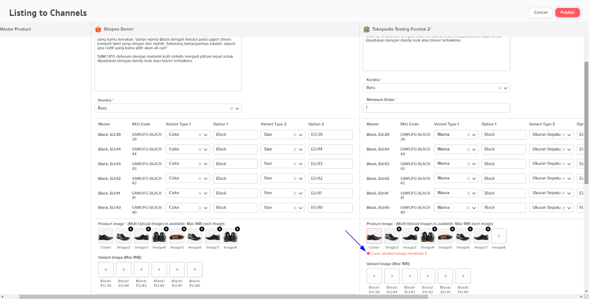

# Add Listing v2 ( NEW )

## **What’s New**

1. **Single Listing :** Multi Store, Multi Channel, Multi Categories, New Interface.
2. **Bulk Listing :** Multi Product, Multi Store, Multi Channel, Multi Categories, New Interface.

## Single Listing

1. Pada menu items, pilih item yang ingin di listingkan. Pilih Manage Listing, kemudian klik Add Listing V2.

<figure><figcaption></figcaption></figure>

2. Kemudian pilih 1 atau lebih store yang akan di listingkan dan pilih Continue.

<figure><figcaption></figcaption></figure>

2. Tab baru akan terbuka pada browser anda. Pilih Category untuk masing-masing store dan Marketplace.

<figure><figcaption></figcaption></figure>

4. Isi field yang di highlight merah atau field required. Geser layar ke kanan untuk melengkapi detail item pada store lainnya.&#x20;


**Note :** Field yang tidak ada <mark style="color:red;">highlight merah</mark> sudah otomatis terisi sesuai dengan Master Product item yang dipilih tetapi anda tetap bisa mengubahnya.


<figure><figcaption></figcaption></figure>

5. Apabila sudah sesuai untuk seluruh field, klik Publish maka proses save dan upload/listing ke marketplace akan berjalan.&#x20;

<figure><figcaption></figcaption></figure>

Jika terdapat field yang belum sesuai maka akan muncul peringatan

<figure><figcaption></figcaption></figure>

Jika sudah sesuai, maka ...

<figure><figcaption></figcaption></figure>

<figure><figcaption></figcaption></figure>

## Bulk Listing

1. Pada menu ...

<figure><figcaption></figcaption></figure>

2. Pilih 1 atau lebih store yang akan di listingkan dan pilih Continue.

<figure><figcaption></figcaption></figure>

2. Tab baru akan terbuka pada browser anda. Pilih Category untuk masing-masing store dan Marketplace. Jika item anda sudah listing, akan muncul peringatan kalau item tersebut sudah terlisting di store

<figure><figcaption></figcaption></figure>

4. Isi field yang di highlight merah atau field required. Geser layar ke kanan dan ke bawah untuk melengkapi detail item dan store lainnya.


**Note :** Field yang tidak ada highlight merah sudah otomatis terisi sesuai dengan Master Product item yang dipilih tetapi anda tetap bisa mengubahnya.

