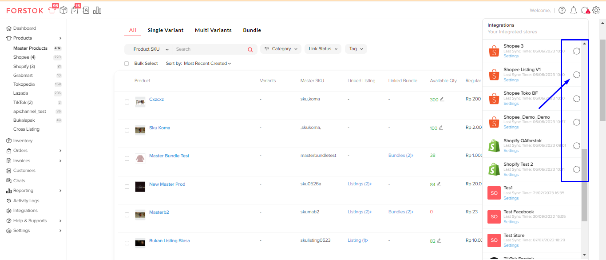
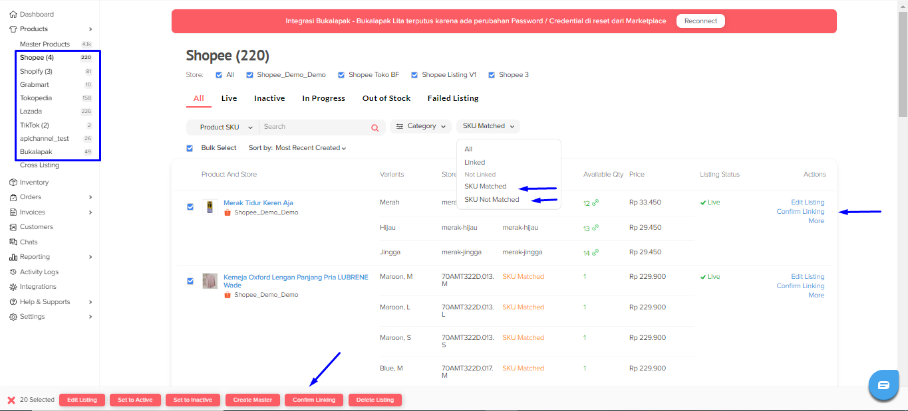
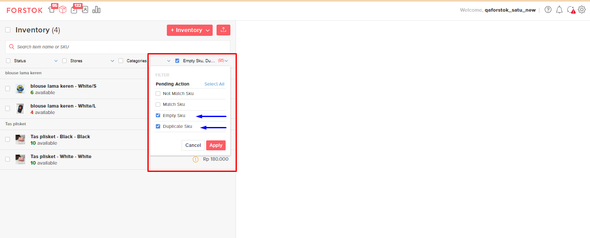

# Impor produk dari channel

1\. Pilih Integrations > Klik sync, jika sudah berwarna hijau dan berputar berarti sedang proses import item.  Tunggu sampai proses nya selesai sampai sync-nya sudah stop atau tidak berputar.

<figure><figcaption></figcaption></figure>

2\. Data item baru yang masuk ke forstok akan masuk ke dalam filter pending action.&#x20;

<figure><figcaption></figcaption></figure>

3\. Saat ini melalui dashboard item V2, juga bisa melakukan confirm linking secara satu persatu ataupun secara bulk dengan menggunakan fitur bulk. Namun yang muncul pada tampilan item V2 ini hanyalah pending actions dengan status: **SKU matched dan SKU unmatched**.

<figure><figcaption></figcaption></figure>

Sedangkan untuk pending actions dengan status **Empty dan Duplicate SKU** masih terpisah sehingga bisa dilihat pada menu inventory (item V1).

<figure><figcaption></figcaption></figure>


**Notes:** Saat ini jika ada kebutuhan untuk menghapus **empty dan duplicate SKU** silahkan diabaikan saja karena untuk saat ini di fitur inventory (item V1) tidak dapat dilakukan penghapusan tersebut.


**Details** :&#x20;

* **N**_**o Match Sku**_, merupakan **sku baru** yang sebelum nya belum pernah ada di forstok. _Action_ yang bisa dilakukan dengan cara klik _**Confirm Import**_.&#x20;
* _**Empty Sku**_ merupakan item produk yang skunya tidak terisi di _seller center_.
* _**Duplicate Sku**_ merupakan item produk yang terdiri dari sku yang sudah pernah ada di forstok sebelumnya.&#x20;
* _**Match Sku**_ merupakan sku yang sama antara satu marketplace dengan marketplace lain. Untuk bisa menyatukan antara marketplace satu dengan lainnya adalah dengan cara _**Confirm Item**_.


* Untuk stok yang sudah habis atau di delete atau di archive, kenapa tidak masuk ke forstok? Karena untuk kedua kategori tersebut memang tidak akan masuk di forstok, kecuali jd.id.&#x20;
* Bagaimana cara menentukan item master dari channel? item channel yang akan di konfirm linking pertama kali akan menjadi item data item master yang ada di forstok.

