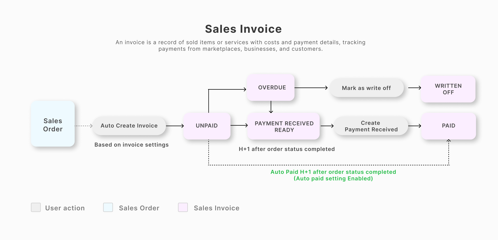

# Edit Listing

1. Klik Edit - Edit Listing pada sku yang ingin dilakukan edit/perubahan

<figure><figcaption></figcaption></figure>

2. Centang pada marketplace yang akan dilakukan perubahan, kemudian pilih category apabila belum tersimpan:

<figure><figcaption></figcaption></figure>


**Pastikan ketika akan melakukan edit listing, item sudah dalam kondisi terkoneksi dengan baik (status centang hijau), dan kondisi marketplace sync item on agar perubahan yang dilakukan di Forstok bisa terupdate ke marketplace**


3. Geser layar ke kanan sampai pada kolom yang terdapat logo dari marketplace:

<figure><figcaption></figcaption></figure>

4. Setelah mengisi/mengganti detail dari item, klik Save.
