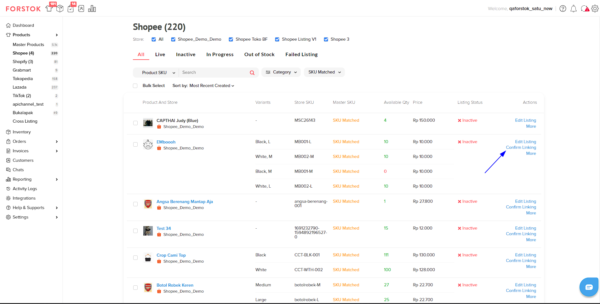
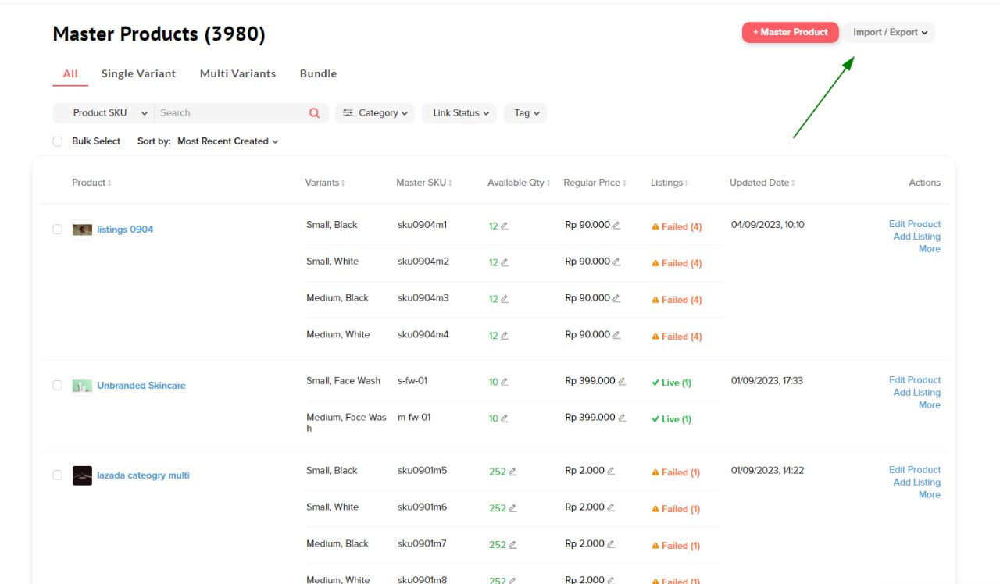

# Listings v.2 Overview (New)

## What's New

1. **List Listing** : Menampilkan List dari Item yang sudah di Listing
2. **Confirm Linking** :&#x20;
3. **Edit Listing** :&#x20;
4. **Active/Inactive** :&#x20;
5. **Delete Listing** :&#x20;

## 1. List Listing

<figure><figcaption></figcaption></figure>

## 2. Confirm Linking

<figure><figcaption></figcaption></figure>

## 3. Edit Listing

<figure><figcaption></figcaption></figure>

## 4. Active/Inactive

<figure><figcaption></figcaption></figure>

## 5. Delete Listing

<figure><figcaption></figcaption></figure>
