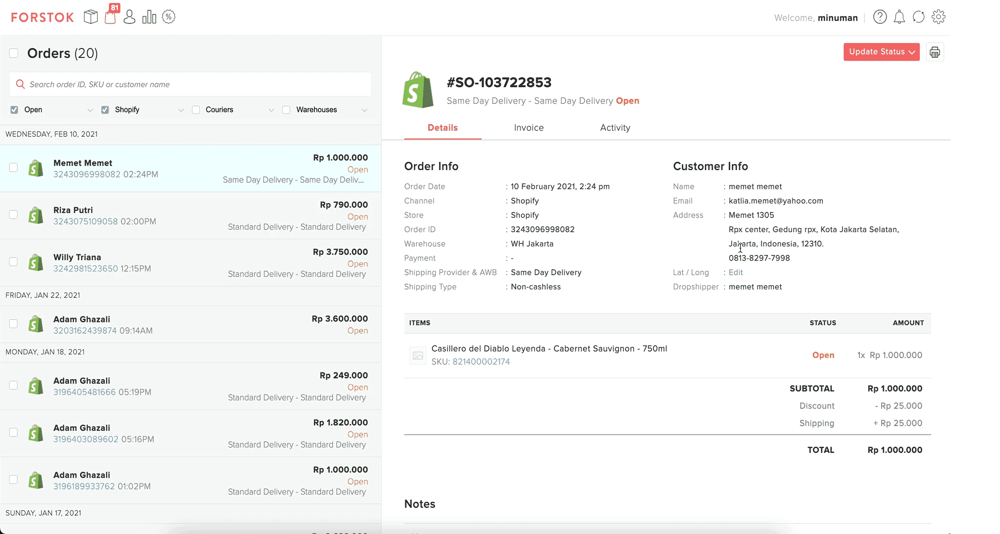

# On Demand Service

You can now accept instant couriers service \(Gosend and GrabExpress\) for your website.  It's an add-on service from Forstok for a cashless service.

**Available Service**: Instant and Same day

**Available Couriers:**

 **** 


Please contact Forstok to enable this feature. Top up payment is required. 


1. Copy shipping address from order \(Skip this step if your website can identify Latitude and Longitude on map to get coordinates during checkout\)
2. Open [Google Map](%20https://maps.google.com).
3. Paste shipping address into Google Map search bar.
4. Right-click on the pin to show Latitude and Longitude information. click to copy 
5. Input Latitude and Longitude, into Lat / Long field in Forstok order page.
6. Click "Update status" to request pickup
7. Select Gosend/ grab express
8. You can get LIVE tracking.

