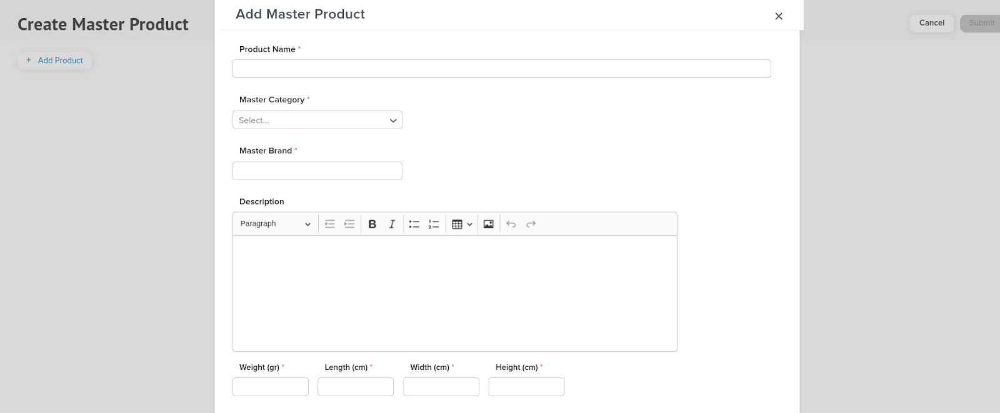
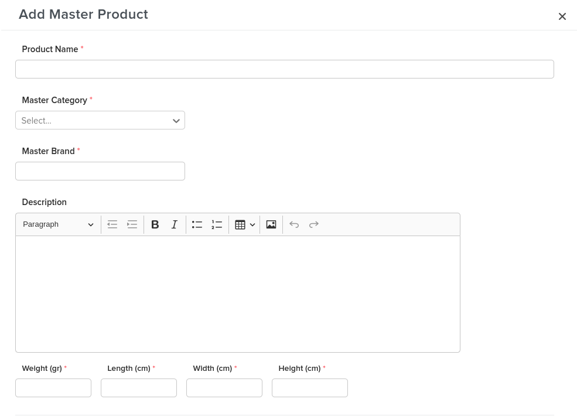
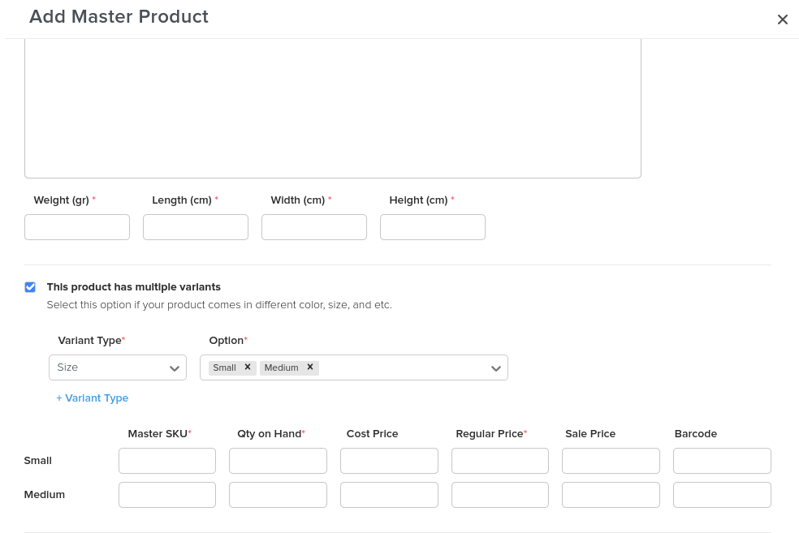
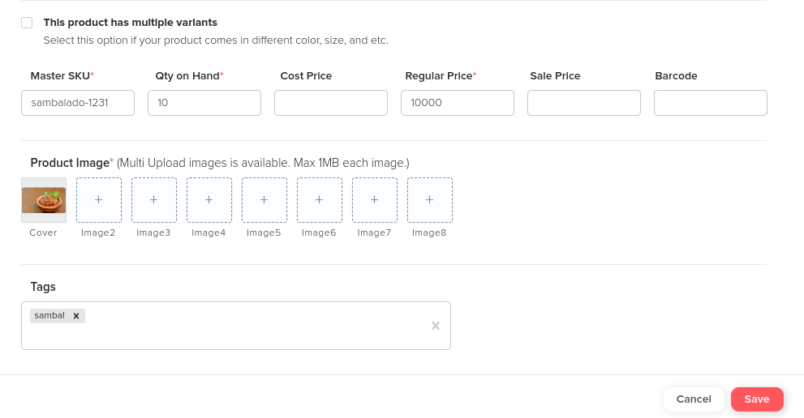
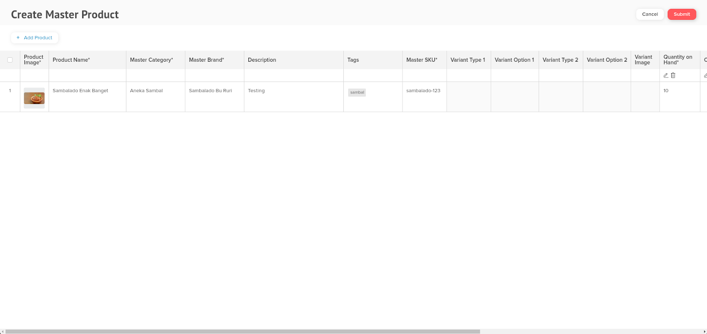

# Add Master Product (NEW)

1\. Pada Master Products list pilih +Master Product -> Add Master Products -> Akan membuka Tab baru pada browser

<figure><figcaption></figcaption></figure>

2\. Klik tombol Add Product, maka akan muncul Field Add Master Product

<figure><figcaption></figcaption></figure>

3. Input Nama Produk pada ‘Product Name’. Pilih Category pada field ‘Master Category’ dan ‘ Master Brand’. Isikan Deskripsi product pada field ‘Description’. Kemudian isi berat, panjang, lebar dan tinggi product pada field ‘Weight’, ‘Length’, ‘Width’, dan ‘Height’.

<figure><figcaption></figcaption></figure>

4. Jika produk Anda mempunyai variant harap klik checkbox berikut dan isi Variant Type dan Option sesuai produk variant Anda. Kemudian isi field Master SKU, Qty on Hand, Regular Price, Cost Price, Sale Price, dan Barcode.


Note: Jika produk Anda tidak mempunyai variant tidak perlu ceklis checkbox tersebut.

Field bertanda ( <mark style="color:red;">\*</mark> ) wajib diisi (mandatory field).


<figure><figcaption></figcaption></figure>

5. Isi gambar produk pada field ‘Product Image’ dan isi gambar varian produk pada field ‘Variant Image’. Isi field ‘Tags’ jika ingin menambahkan tag tentang produk. Kemudian klik save.


Note: Gambar produk wajib diisi sesuai dengan produk. Variant image bersifat opsional (boleh diisi, boleh tidak).


<figure><figcaption></figcaption></figure>

6. Scroll ke samping jika masih ingin merubah field master produk. Apabila ingin menambahkan produk, klik ‘Add Product’ kemudian ikuti langkah sebelumnya. Jika sudah tidak ada lagi yang ingin ditambahkan silahkan klik submit.

<figure><figcaption></figcaption></figure>


Untuk menambahkan Master Product lebih banyak, dapat dilakukan dengan memilih + Add Product pada bagian kiri dari table product yang sudah dibuat.&#x20;


7. Maka Master Product berhasil ditambahkan

<figure><figcaption></figcaption></figure>


Note : Untuk melihat master product yang sudah di tambahkan, bisa menggunakan sort by : Most Recent Created&#x20;

