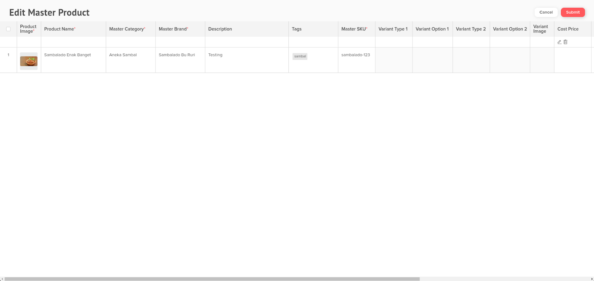
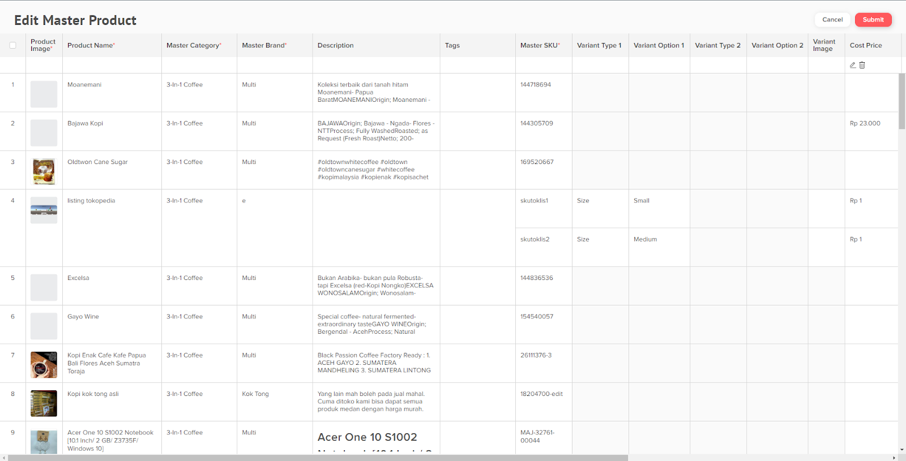

# Edit Master Product (NEW)

Ada 2 cara untuk Edit Master Product, Edit satu master product dan Edit banyak master product (Bulk Edit)

### Single Edit Master Product

1. pertama pada menu master products klik Edit Product pada bagian column Actions.

<figure><figcaption></figcaption></figure>

2. Silahkan Edit artikel produk yang ingin diperbaiki. Scroll ke kanan untuk lihat lebih lengkap field artikel. Jika sudah selesai pilih submit.

<figure><figcaption></figcaption></figure>

### Bulk Edit Master Product (NEW)

1. Pilih beberapa items/product yang ingin diubah kemudian pilih **Edit Product**. Akan membuka tab baru pada browser.

<figure><figcaption></figcaption></figure>

2. Silahkan Edit artikel produk-produk yang ingin diperbaiki. Scroll ke kanan untuk lihat lebih lengkap field artikel. Jika sudah selesai pilih submit.

<figure><figcaption></figcaption></figure>
