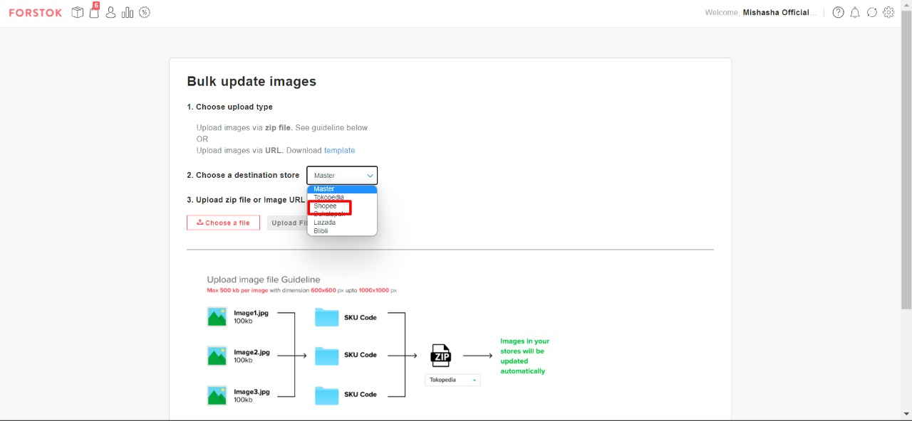

# Update Image/Foto

Untuk merubah atau mengganti Foto pada master product atau marketplace bisa dilakukan dari Forstok:

1. Pilih sku yang akan diganti fotonya, pilih Edit - Edit item

 (1) (1) (1) (1).png>)

2\. Pilih channel yang akan di Edit, lalu edit

 (1) (1) (1).png>)

3\. Scroll ke kanan lalu pilih pada field yang ingin diubah, apabila foto pada channel/marketplace, maka double tap pada kolom yang terdapat logo marketplace. Lalu tinggal di ganti imagenya.

 (1) (1).png>)

 (1) (1) (1) (1).png>)

4\. Jika sudah di save bisa cek kembali sku tersebut di Forstok, klik link product atau lihat di seller center, untuk perubahan image pada master product maka bisa dilihat gambar yang terupload di Forstok.


Apabila gagal melakukan update image melalui fitur Edit Item, anda bisa  melakukan update image kembali dengan upload ulang image di kolom image channel pada fitur Edit Item, atau menggunakan fitur Upload Images:

&#x20;

Pilih Marketplace yang anda tuju, ikuti instruksi yang terdapat di halaman fitur Bulk Update Images:

&#x20;


