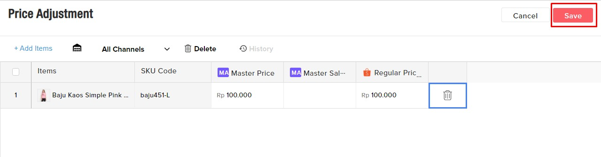

# Price Adjustment (interface)

Langkah-langkah yang bisa dilakukan untuk adjust quantity adalah :\
&#x20;  1\. Pilih item yang akan di rubah harganya

<figure><figcaption></figcaption></figure>

&#x20;  2\. Klik Adjust Price Pada item yang akan di update.

<figure><figcaption></figcaption></figure>

&#x20;  3\. Scroll ke kanan dan input jumlah price di setiap marketplace atau kolom tersebut. Lalu **Save**.\

 
