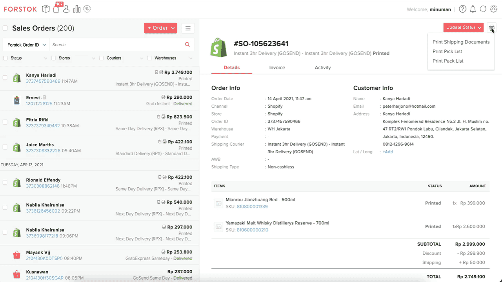

# Print Pack List

### Print Packlist dari satu atau multiple order&#x20;

Berikut merupakan cara untuk melakukan print pack list :&#x20;

1\. Pilih halaman Order.

2\. Pilih order mana yang akan di print pack list nya.&#x20;

3\. Pada **Right pannel** pilih simbol print lalu pilih pack list.

.png>)

4\. lalu akan muncul sheet nya seperti ini, klik print

.png>)
