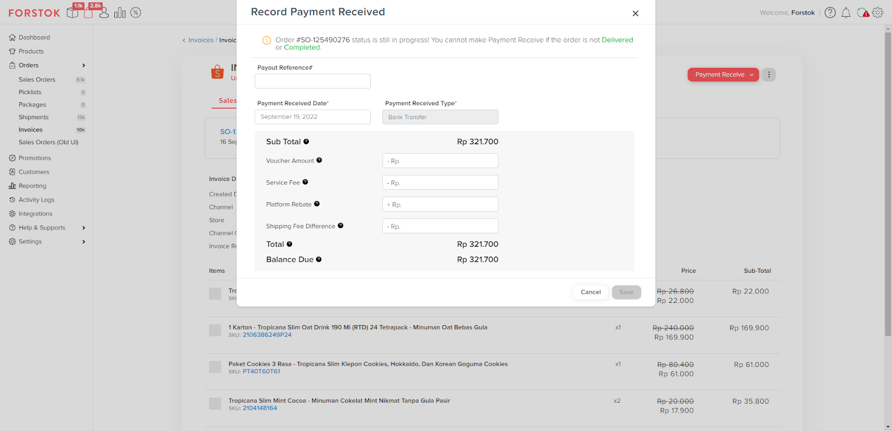

# Payment Received Manual

Fitur ini digunakan untuk melakukan _Payment Receive_ terhadap invoice yang detail amountnya belum tersedia via API. Anda dapat melakukan input amount berdasarkan dari masing-masing fieldnya.

<figure><figcaption></figcaption></figure>
