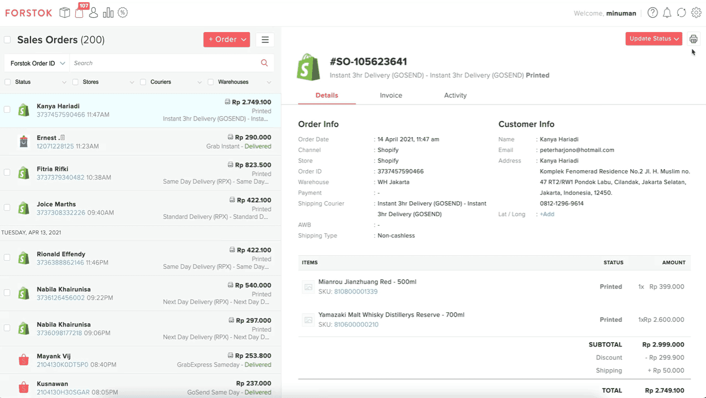

# Print Pick List

## **Alur Proses Video**

Print picklist dari satu atau mulitple order

## **Alur Proses**

Ikuti beberapa langkah sederhana untuk membuat dan menerima daftar pilihan:

1. Pilih halaman Order.

2. Pilih order mana yang akan di print pick list nya. 

3. Pada **Right pannel** pilih simbol print lalu pilih pick list.

4. lalu akan muncul sheet nya seperti ini, klik print

